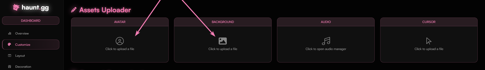
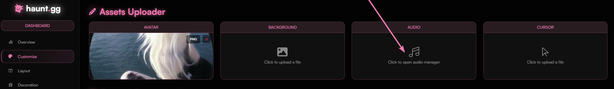
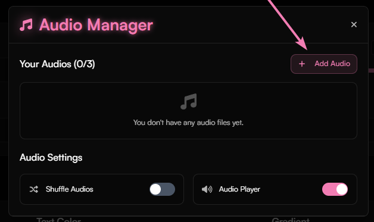
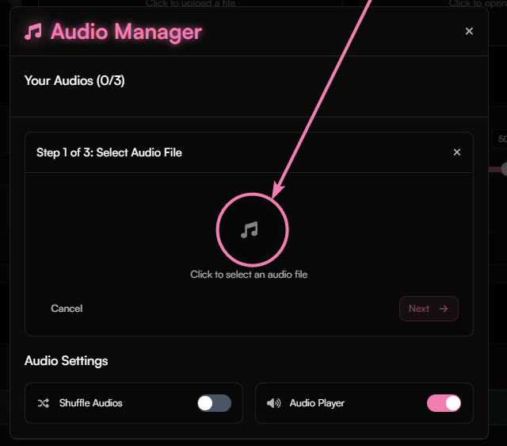
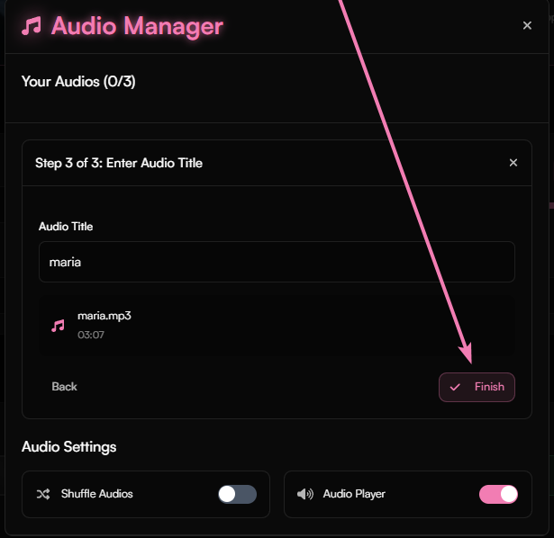
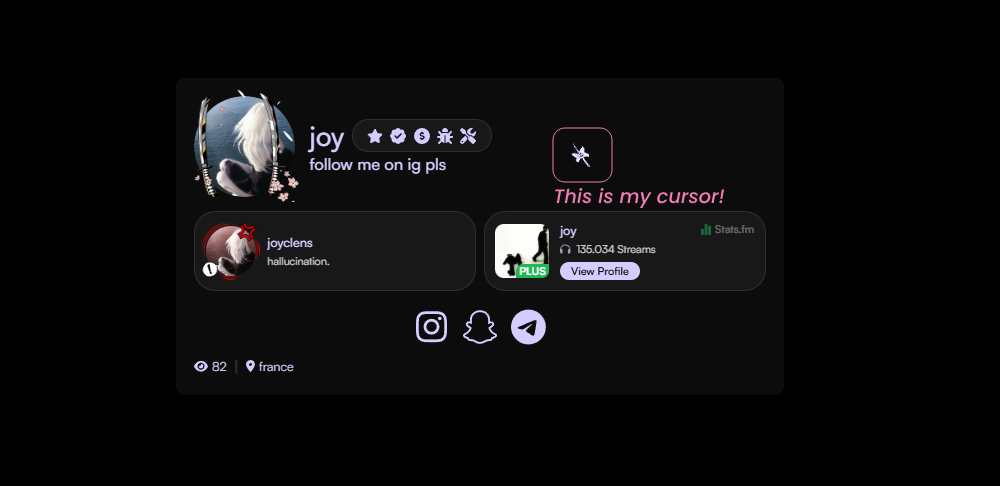

## How to upload avatar/background?

<Steps>
    <Step title="Access Customize Page">
        Head over to [haunt.gg/dashboard/customize](https://haunt.gg/dashboard/customize) and click on what asset you want to upload.
    </Step>
    <Step title="Choose Your Image">
        Once you choose what image you wish to have uploaded, you can crop it to your liking.
    </Step>
    <Step title="Apply Changes">
        Once cropped, hit **Apply**, and you're done!
    </Step>
</Steps>

<Frame>
    
</Frame>

## How to upload audios?

<Steps>
    <Step title="Access Audio Manager">
        In the same location where you customize your avatar, hit the audio manager, and a new UI will appear. Click the "Add Audio" button, and make sure it's a **supported filetype as told above.**
    </Step>
    <Step title="Choose Cover Image (Optional)">
        When you've chosen a song, you have the option to select a cover image, although this is **optional** and you can just press the `Skip` button.
    </Step>
    <Step title="Set Audio Title">
        Next, you're choosing the audio title! You can do anything for this, just make sure it abides by our [**Terms of Service**](https://haunt.gg/terms)
    </Step>
    <Step title="Finish Upload">
        Once you have your title, hit `Finish` and you're done!
    </Step>
</Steps>

<Tabs>
    <Tab title="Audio Upload Interface">
        <Frame>
            
        </Frame>
    </Tab>
    <Tab title="Audio Manager Interface">
        <Frame>
            
        </Frame>
    </Tab>
    <Tab title="Audio Selection Input">
        <Frame>
            
        </Frame>
    </Tab>
    <Tab title="Audio Title Input">
        <Frame>
            
        </Frame>
    </Tab>
</Tabs>

## How to upload cursors?

<Steps>
    <Step title="Access Cursor Container">
        In the same location where you customize your avatar, hit the "Cursor" container, and make sure it's a **supported filetype as told above.**
    </Step>
    <Step title="View Your Cursor">
        Once you have selected your file, it has been uploaded! Head over to your page *(for example: [haunt.gg/j](https://haunt.gg/j))* and you can see your cursor!
    </Step>
</Steps>

<Tabs>
    <Tab title="Cursor Upload Interface">
        <Frame>
            
        </Frame>
    </Tab>
    <Tab title="Cursor Preview">
        <Frame>
            
        </Frame>
    </Tab>
</Tabs>

<Info>
    You can use [**custom-cursor.com**](https://custom-cursor.com/en/collections) for some cursors, although there are **plenty** other websites available.
</Info>

## Supported File Types

| Asset Type | Supported Extensions |
|------------|---------------------|
| **Profile Picture (Avatar)** | `.png`, `.jpg`, `.jpeg`, `.gif`, `.webp` |
| **Cursor** | `.png`, `.jpg`, `.jpeg`, `.gif`, `.webp`, `.cur`, `.ico` |
| **Backgrounds** | `.png`, `.jpg`, `.jpeg`, `.gif`, `.webp`, `.webm` `.mp4` |
| **Banners** | `.png`, `.jpg`, `.jpeg`, `.gif`, `.webp` |
| **Custom Badges** | `.png`, `.jpg`, `.jpeg`, `.gif`, `.webp` |
| **Covers** | `.png`, `.jpg`, `.jpeg`, `.gif`, `.webp` |
| **Audio Files** | `.mp3`, `.wav`, `.ogg` |
| **Favicon** | `.png`, `.jpg`, `.jpeg`, `.gif`, `.webp`, `.ico` |
| **Fonts** | `ttf`, `otf`, `woff`, `woff2` |
