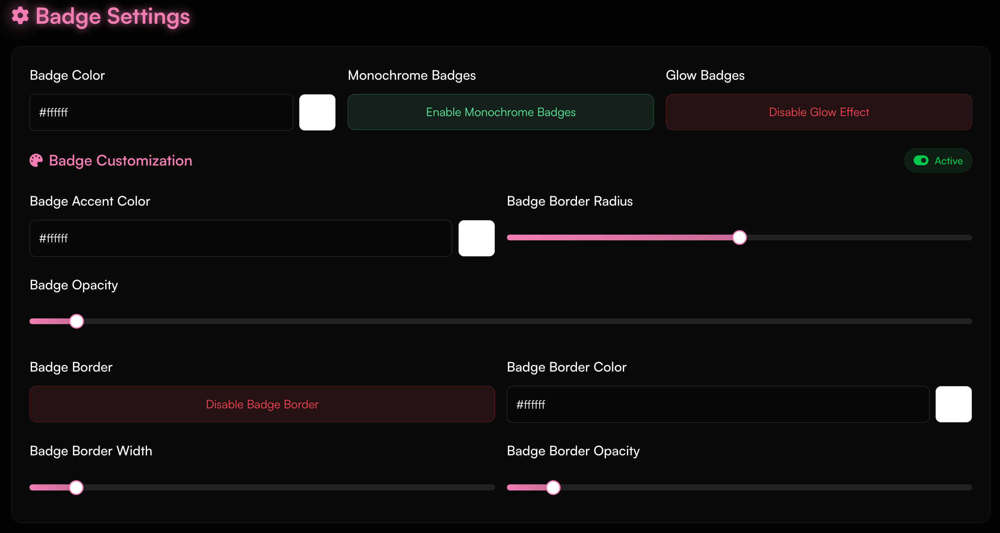
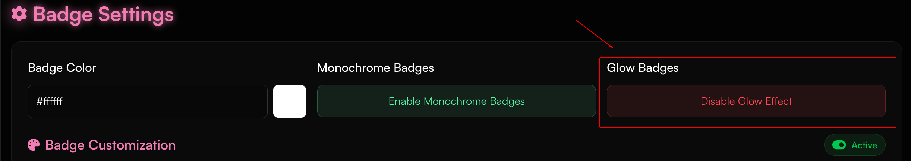
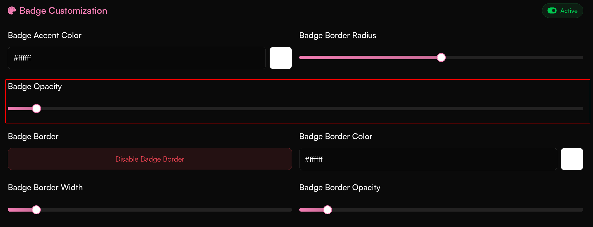
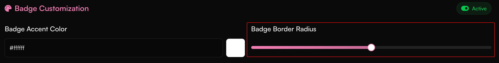
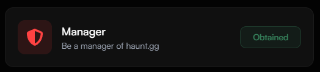

## How can I customize my badges?

<Steps>
  <Step title="Open the Badge Settings Page">
    Visit [https://haunt.gg/dashboard/badges](https://haunt.gg/dashboard/badges) to get started.
  </Step>
</Steps>

## Badge Customization

<Steps>
  <Step title="Open the Section">
    Go to the **Badge Customization** section.
  </Step>
  <Step title="Start Customizing">
    You’ll find various options to personalize your badges—like glow, border, and layout tweaks.
  </Step>
</Steps>

<Frame>
  
</Frame>

## Color Customization

<Steps>
  <Step title="Open the Section">
    Go to the **Color Customization** section.
  </Step>
  <Step title="Choose Your Colors">
    You can modify badge colors.
  </Step>
</Steps>

<Frame>
  
</Frame>

## Border Customization

<Steps>
  <Step title="Open the Section">
    Go to the **Border Customization** section.
  </Step>
  <Step title="Adjust the Border">
    Toggle borders on/off, change their width, or make them transparent.
  </Step>
</Steps>

<Frame>
  
</Frame>

## Glow Customization

<Steps>
  <Step title="Open the Section">
    Go to the **Glow Customization** section.
  </Step>
  <Step title="Set the Glow">
    Adjust glow being on/off with your badges.
  </Step>
</Steps>

<Frame>
  
</Frame>

## Opacity Settings

<Steps>
  <Step title="Open the Section">
    Go to the **Badge Opacity** section.
  </Step>
  <Step title="Adjust Opacity">
    Drag the slider to set how transparent your badge appears.
  </Step>
</Steps>

<Frame>
  
</Frame>

## Border Radius

<Steps>
  <Step title="Open the Section">
    Go to the **Badge Border Radius** section.
  </Step>
  <Step title="Adjust Radius">
    Customize how wide the border of your badges should be.
  </Step>
</Steps>

<Frame>
  
</Frame>

### Owner Badge

<Frame caption="The owner badge is a badge that is given to the owner of haunt.gg.">
    
</Frame>

### Manager Badge

<Frame caption="The manager badge is a badge that is given to the manager of haunt.gg.">
    
</Frame>

### Staff Badge

<Frame caption="The staff badge is a badge that is given to the staff of haunt.gg.">
    
</Frame>

<Note>
    You can apply to become a staff member [here](https://discord.gg/hauntbio).
</Note>

### OG Badge

<Frame caption="The OG badge is a badge that is given to the original members of haunt.gg.">
    
</Frame>

<Note>
    This badge is no longer available to new users.
</Note>

### Verified Badge

<Frame caption="The verified badge is a badge that is given to users who have been verified by haunt.gg.">
    
</Frame>

<Note>
    You can purchase this badge [here](https://haunt.gg/pricing) or learn [here](/guides/verification) how to verify your account.
</Note>

### Bug Hunter Badge

<Frame caption="The bug hunter badge is a badge that is given to users who have reported bugs to haunt.gg.">
    
</Frame>

<Note>
    You can report bugs [here](https://discord.gg/hauntbio) or via [email](mailto:support@haunt.gg).
</Note>

### Donor Badge

<Frame caption="The donor badge is a badge that is given to users who have [donated](https://haunt.gg/pricing) to haunt.gg.">
    
</Frame>

<Note>
    You can purchase a donor badge [here](https://haunt.gg/pricing).
</Note>

### Premium Badge

<Frame caption="The premium badge is a badge that is given to users who have a [premium subscription](https://haunt.gg/pricing).">
    
</Frame>

<Note>
    You can purchase a premium subscription [here](https://haunt.gg/pricing).
</Note>

### Server Booster Badge

<Frame caption="The server booster badge is a badge that is given to users who have boosted our [server](https://discord.gg/hauntbio).">
    
</Frame>

<Note>
    You can boost our server [here](https://discord.gg/hauntbio).
</Note>

### Beta Badge

<Frame caption="The beta badge is a badge that is given to users who are part of the beta testing program.">
    
</Frame>

<Note>
    This badge is no longer available to new users.
</Note>

### Innovator Badge

<Frame caption="The innovator badge is a badge that is given to users who have suggested features that improve our platform.">
    
</Frame>

<Note>
    You can suggest features [here](https://discord.gg/hauntbio) or via [email](mailto:support@haunt.gg).
</Note>

### Contributor Badge

<Frame caption="The contributor badge is a badge that is given to users who have contributed to our platform.">
    
</Frame>

<Note>
    You can contribute content to our [documentation](https://github.com/curet-dev/docs) to earn this badge.
</Note>

### Custom Badges

<Frame caption="The custom badge is a badge that is given to users who have purchased a custom badge.">
    
</Frame>

<Note>
    When you purchase a [custom badge](https://haunt.gg/pricing), you can choose your own icon and name for the badge.
</Note>
