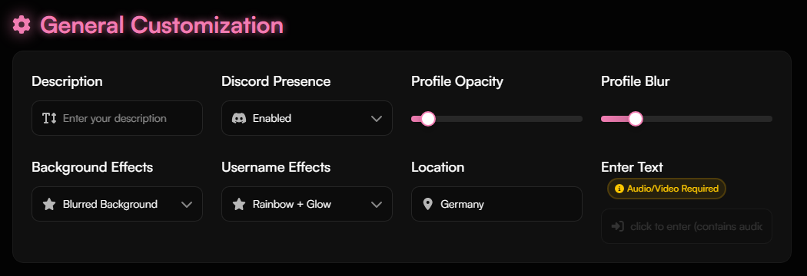
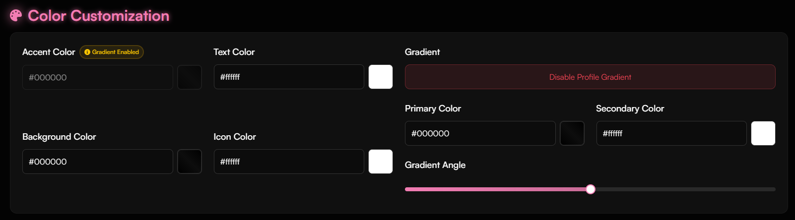
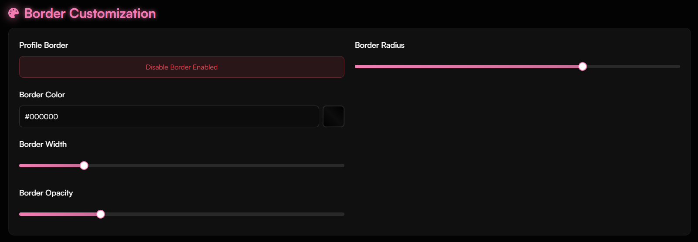
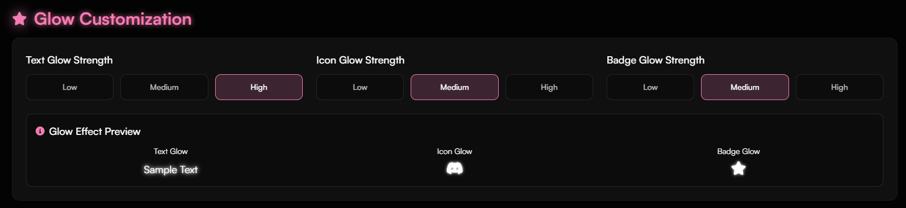
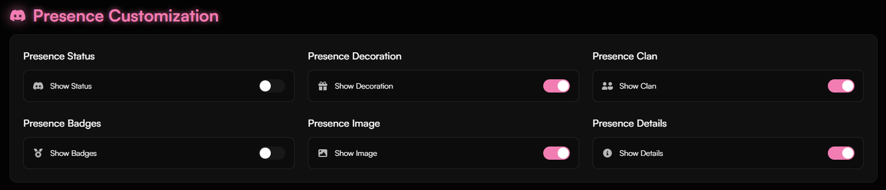
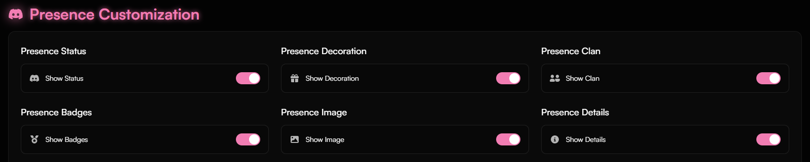
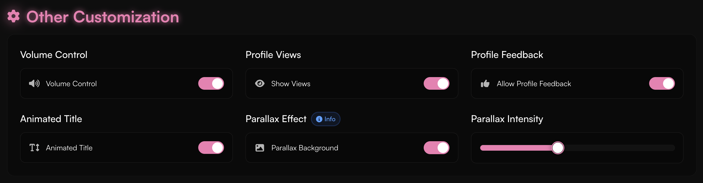

<Card title="General Customization" icon="circle-1" href="../customization/customization#general-customization" horizontal>
Learn how to customize your profile on haunt.gg.
</Card>

<Card title="Color Customization" icon="circle-2" href="../customization/customization#color-customization" horizontal>
Learn how to customize your profile on haunt.gg.
</Card>

<Card title="Border Customization" icon="circle-3" href="../customization/customization#border-customization" horizontal>
Learn how to customize your profile on haunt.gg.
</Card>

<Card title="Glow Customization" icon="circle-4" href="../customization/customization#glow-customization" horizontal>
Learn how to customize your profile on haunt.gg.
</Card>

<Card title="Presence Customization" icon="circle-5" href="../customization/customization#presence-customization" horizontal>
Learn how to customize your profile on haunt.gg.
</Card>

<Card title="Advanced presence settings" icon="circle-6" href="../customization/customization#advanced-presence-settings" horizontal>
Learn how to customize your profile on haunt.gg.
</Card>

<Card title="Other Customization" icon="circle-7" href="../customization/customization#other-customization" horizontal>
Learn how to customize your profile on haunt.gg.
</Card>

## How can I customize my profile?

<Steps>
  <Step title="Open the Customize Page">
    Visit [haunt.gg/dashboard/customize](https://haunt.gg/dashboard/customize) to get started.
  </Step>
</Steps>

## Assets Uploader

To upload your assets, follow the instructions [here](../customization/assets).

## General Customization

<Steps>
  <Step title="Open the Section">
    Go to the **General Customization** section.
  </Step>
  <Step title="Start Customizing">
    You’ll find various options to personalize your profile, like adding a description or applying effects.
  </Step>
</Steps>

<Frame>
  
</Frame>

<Warning>
To set an enter text, you need to have an audio or video selected.
</Warning>

## Color Customization

<Steps>
  <Step title="Open the Section">
    Go to the **Color Customization** section.
  </Step>
  <Step title="Choose Your Colors">
    Here, you can change colors for icons, text, and more.
  </Step>
</Steps>

<Frame>
  
</Frame>

<Warning>
You can’t choose an accent color if a profile gradient is active.
</Warning>

## Border Customization

<Steps>
  <Step title="Open the Section">
    Go to the **Border Customization** section.
  </Step>
  <Step title="Adjust the Border">
    You can enable/disable the border and adjust its radius here.
  </Step>
</Steps>

<Frame>
  
</Frame>

## Glow Customization

<Steps>
  <Step title="Open the Section">
    Go to the **Glow Customization** section.
  </Step>
  <Step title="Set the Glow">
    Customize the glow strength for text, icons, and badges.
  </Step>
</Steps>

<Frame>
  
</Frame>

## Presence Customization

<Steps>
  <Step title="Open the Section">
    Go to the **Presence Customization** section.
  </Step>
  <Step title="Adjust Presence">
    Toggle visibility for different presence options like decorations, status, tags, and more.
  </Step>
</Steps>

<Frame>
  
</Frame>

## Advanced presence settings

<Steps>
    <Step title="Activate Advanced Presence Settings">
        Enable advanced presence settings by toggling the option on in the **Presence Customization** section.
    </Step>
    <Step title="Configure Settings">
        Configure your advanced Discord presence settings however you like.
    </Step>
</Steps>

<Frame>
  
</Frame>

## Other Customization

<Steps>
  <Step title="Open the Section">
    Go to the **Other Customization** section.
  </Step>
  <Step title="More Options">
    Set features like volume control, the parallax effect, and others.
  </Step>
</Steps>

<Frame>
  
</Frame>

<Warning>
To use volume control, a video or audio must be set.
</Warning>

<Note>
Parallax effect creates subtle movement in the background when the mouse moves.
</Note>

