## Profile Assets

### How to upload avatar/background?

<Steps>
  <Step title="Access Customize Page">
    Head over to [haunt.gg/dashboard/customize](https://haunt.gg/dashboard/customize) and click on what asset you want to upload.
  </Step>
  <Step title="Choose Your Image">
    Once you choose what image you wish to have uploaded, you can crop it to your liking.
  </Step>
  <Step title="Apply Changes">
    Once cropped, hit **Apply**, and you're done!
  </Step>
</Steps>

<Frame>
  
</Frame>

### How to upload audios?

<Steps>
  <Step title="Access Audio Manager">
    In the same location where you customize your avatar, hit the audio manager, and a new UI appears. Click the "Add Audio" button, and make sure it's a **supported filetype as told above.**
  </Step>
  <Step title="Choose Cover Image (Optional)">
    When you've chosen a song, you have the option to select a cover image, although this is **optional** and you can just press the `Skip` button.
  </Step>
  <Step title="Set Audio Title">
    Next, you're choosing the audio title! You can do anything for this, just make sure it abides with our [**Terms of Service**](https://haunt.gg/terms)
  </Step>
  <Step title="Finish Upload">
    Once you have your title, hit `Finish` and you're done!
  </Step>
</Steps>

<Tabs>
  <Tab title="Audio Upload Interface">
    <Frame>
      
    </Frame>
  </Tab>
  <Tab title="Audio Manager Interface">
    <Frame>
      
    </Frame>
  </Tab>
  <Tab title="Audio Selection Input">
    <Frame>
      
    </Frame>
  </Tab>
  <Tab title="Audio Title Input">
    <Frame>
      
    </Frame>
  </Tab>
</Tabs>

### How to upload cursors?

<Steps>
  <Step title="Access Cursor Container">
    In the same location where you customize your avatar, hit the "Cursor" container, and make sure it's a **supported filetype as told above.**
  </Step>
  <Step title="View Your Cursor">
    Once you have selected your file, it has been uploaded! Head over to your page *(for example: [haunt.gg/j](https://haunt.gg/j))* and you can see your cursor!
  </Step>
</Steps>

<Tabs>
  <Tab title="Cursor Upload Interface">
    <Frame>
      
    </Frame>
  </Tab>
  <Tab title="Cursor Preview">
    <Frame>
      
    </Frame>
  </Tab>
</Tabs>

<Info>
  You can use [**custom-cursor.com**](https://custom-cursor.com/en/collections) for some cursors, although there are **plenty** other websites available.
</Info>

### Supported File Types

| Asset Type | Supported Extensions |
|------------|----------------------|
| **Profile Picture (Avatar)** | `.png`, `.jpg`, `.jpeg`, `.gif`, `.webp` |
| **Cursor** | `.png`, `.jpg`, `.jpeg`, `.gif`, `.webp`, `.cur`, `.ico` |
| **Backgrounds** | `.png`, `.jpg`, `.jpeg`, `.gif`, `.webp`, `.mp4` |
| **Banners** | `.png`, `.jpg`, `.jpeg`, `.gif`, `.webp` |
| **Custom Badges** | `.png`, `.jpg`, `.jpeg`, `.gif`, `.webp` |
| **Covers** | `.png`, `.jpg`, `.jpeg`, `.gif`, `.webp` |
| **Audio Files** | `.mp3`, `.wav`, `.ogg` |
| **Favicon** | `.png`, `.jpg`, `.jpeg`, `.gif`, `.webp`, `.ico` |

---

## Profile Badges

<Frame caption="The owner badge is a badge that is given to the owner of haunt.gg.">
  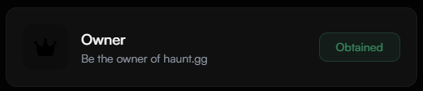
</Frame>

<Frame caption="The staff badge is a badge that is given to the staff of haunt.gg.">
  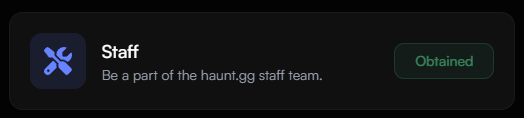
</Frame>

<Note>You can apply to become a staff member [here](https://discord.gg/hauntbio).</Note>

<Frame caption="The OG badge is a badge that is given to the original members of haunt.gg.">
  
</Frame>

<Note>This badge is no longer available to new users.</Note>

<Frame caption="The verified badge is a badge that is given to users who have been verified by haunt.gg.">
  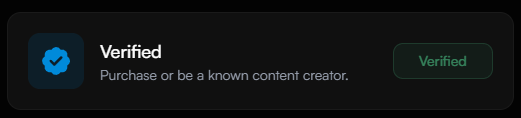
</Frame>

<Note>You can purchase this badge [here](https://haunt.gg/pricing) or learn [here](/guides/verification) how to verify your account.</Note>

<Frame caption="The bug hunter badge is a badge that is given to users who have reported bugs to haunt.gg.">
  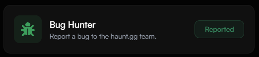
</Frame>

<Note>You can report bugs [here](https://discord.gg/hauntbio) or via [email](mailto:support@haunt.gg).</Note>

<Frame caption="The donor badge is a badge that is given to users who have donated to haunt.gg.">
  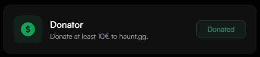
</Frame>

<Note>You can purchase a donor badge [here](https://haunt.gg/pricing).</Note>

<Frame caption="The premium badge is a badge that is given to users who have a premium subscription.">
  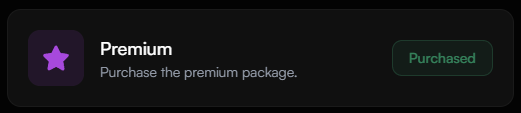
</Frame>

<Note>You can purchase a premium subscription [here](https://haunt.gg/pricing).</Note>

<Frame caption="The server booster badge is a badge that is given to users who have boosted our server.">
  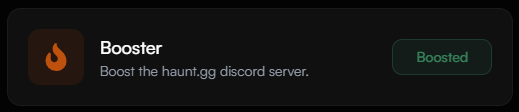
</Frame>

<Note>You can boost our server [here](https://discord.gg/hauntbio).</Note>

<Frame caption="The beta badge is a badge that is given to users who are part of the beta testing program.">
  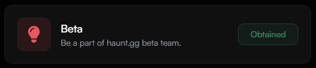
</Frame>

<Note>This badge is no longer available to new users.</Note>

<Frame caption="The innovator badge is a badge that is given to users who have suggested features that improve our platform.">
  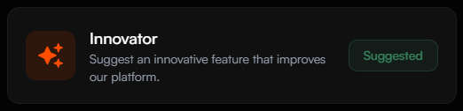
</Frame>

<Note>You can suggest features [here](https://discord.gg/hauntbio) or via [email](mailto:support@haunt.gg).</Note>

<Frame caption="The contributor badge is a badge that is given to users who have contributed to our platform.">
  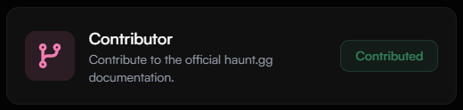
</Frame>

<Note>You can contribute content to our [documentation](https://github.com/curet-dev/docs) to earn this badge.</Note>

<Frame caption="The custom badge is a badge that is given to users who have purchased a custom badge.">
  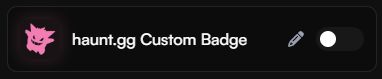
</Frame>

<Note>When you purchase a [custom badge](https://haunt.gg/pricing), you can choose your own icon and name for the badge.</Note>

---

## Profile Decorations

### Getting Started with Decorations

<Steps>
  <Step title="Open the Decorations Page">
    Head to [haunt.gg/dashboard/decoration](https://haunt.gg/dashboard/decoration) to explore the decorations.
    <Frame>
      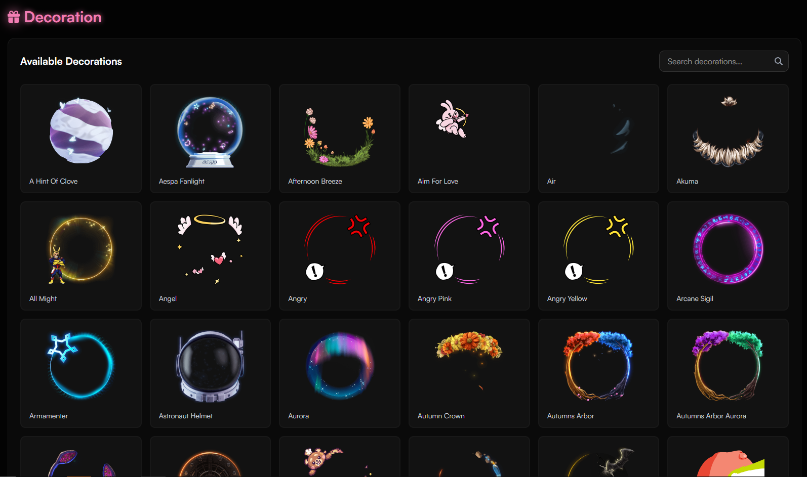
    </Frame>
  </Step>
  <Step title="Browse or Search">
    Use page navigation or the search bar to find decorations by name or style.
  </Step>
  <Step title="Apply It">
    Click on a decoration, then hit **Apply Changes** to add it to your profile.
  </Step>
</Steps>

### See It In Action

<Steps>
  <Step title="Preview Your Profile">
    Once applied, your decoration shows up on your profile right away. Visit [haunt.gg/j](https://haunt.gg/j) to see an example in use.
    <Frame>
      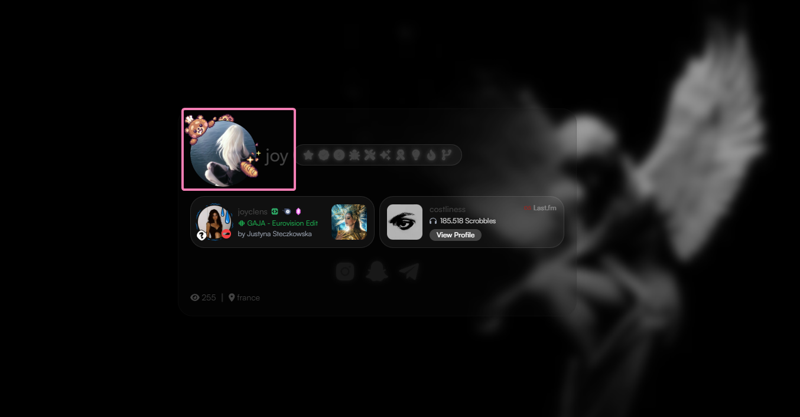
    </Frame>
  </Step>
  <Step title="Swap Anytime">
    You can change decorations anytime by selecting a new one and hitting **Apply Changes**.
  </Step>
</Steps>

---

## Profile Links

### How to add a link?

<Steps>
  <Step title="Access Links Page">
    Head over to [haunt.gg/dashboard/links](https://haunt.gg/dashboard/links) and click on ``Add New Link`.
  </Step>
  <Step title="Choose Your Platform">
    Choose `Hyperlink` to add a URL or `Copyable Text` to add your username.
  </Step>
  <Step title="Add Link">
    Paste your info, click `Add Link` and you're done!
  </Step>
</Steps>

<Frame>
  
</Frame>

### How to add a custom link?

<Steps>
  <Step title="Choose Custom Platform">
    Select `Custom` as your platform on the add link page.
  </Step>
  <Step title="Customize Settings">
    Change title, icon, URL, or add copyable text. Then hit `Add Link`.
  </Step>
</Steps>

<Frame>
  
</Frame>

### How to customize link icons?

#### Global Settings

Change icon color, monochrome effect, and glow via `Icon Settings`.

<Frame>
  
</Frame>

#### Individual Colors

Turn off monochrome, then click the palette icon next to each link.

<Frame>
  
</Frame>

<Expandable title="List of supported link platforms">
- Snapchat  
- Youtube  
- Discord (Server/User)  
- Spotify  
- Instagram  
- X (Twitter)  
- TikTok  
- Telegram  
- SoundCloud  
- PayPal  
- GitHub/GitLab  
- Twitch/Kick  
- Reddit  
- LinkedIn  
- Steam  
- Pinterest  
- Last.fm  
- Facebook  
- Patreon  
- Genius  
- OnlyFans  
- Roblox  
- NameMC  
- Stats.fm  
- Labynet  
- Bitcoin/Litecoin/Ethereum/Solana  
- Mail  
- Custom  
</Expandable>

---

## Profile Templates

### Getting Started with Templates

<Steps>
  <Step title="Open the Templates Page">
    Head to [haunt.gg/dashboard/templates](https://haunt.gg/dashboard/templates).
  </Step>
  <Step title="Find One You Like">
    Use filters or search by style or creation date.
  </Step>
  <Step title="Apply It">
    Click **Use Template** to instantly apply it to your profile.
  </Step>
</Steps>

### What’s Inside the Templates Page

<Tabs>
  <Tab title="All Templates">
    - Public templates from all users  
    - Free and premium templates available
  </Tab>
  <Tab title="My Templates">
    - Your own created templates  
    - Editable and removable anytime
  </Tab>
  <Tab title="Favorites">
    - Templates you’ve starred for quick access
  </Tab>
</Tabs>

### Template Cards

<Steps>
  <Step title="Screenshot Preview">
    A preview image helps you see the template at a glance.
  </Step>
  <Step title="Tags & Info">
    Tags like `dark`, `minimal`, `y2k` show the style.
  </Step>
  <Step title="Quick Actions">
    Use, preview, or share your template easily.
    <Frame>
      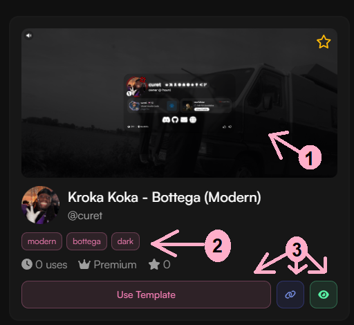
    </Frame>
  </Step>
</Steps>

### Make Your Own Template

<Steps>
  <Step title="Create One">
    Click **Create Template** at the top-right.
    <Frame>
      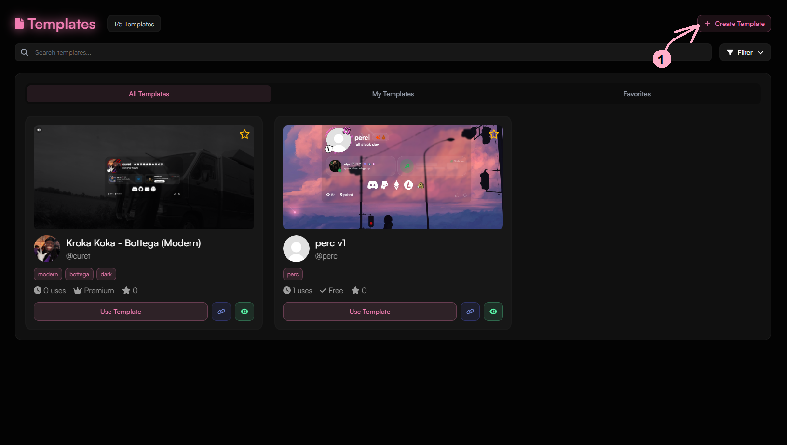
    </Frame>
  </Step>
  <Step title="Fill Out Details">
    Name it, tag it, image it, choose privacy, hit **Create**.
    <Frame>
      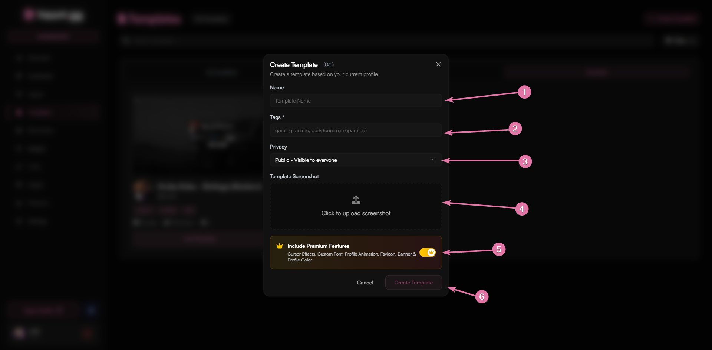
    </Frame>
  </Step>
  <Step title="Share & Reuse">
    Public = discoverable. Private = personal. Reuse anytime.
  </Step>
</Steps>

### Manage Templates

<Steps>
  <Step title="Edit Your Template">
    Go to **My Templates**, click **Edit**, change name/tags/privacy.
    <Frame>
      
    </Frame>
  </Step>
  <Step title="Delete a Template">
    Use the delete icon to permanently remove a template.
  </Step>
</Steps>

<Tabs>
  <Tab title="Limits">
    - Free users: **3 templates**  
    - Premium users: **5 templates**
  </Tab>
  <Tab title="Tips">
    - Name clearly  
    - Preview before applying  
    - Star your favorites
  </Tab>
</Tabs>
