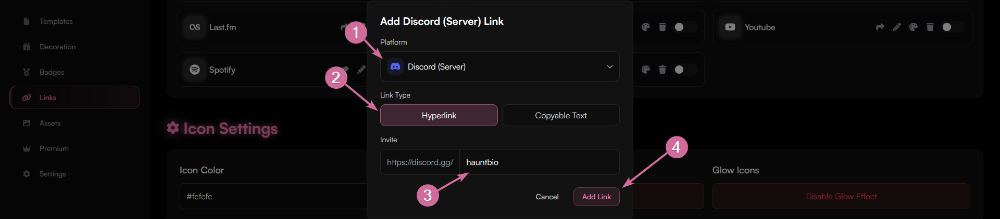
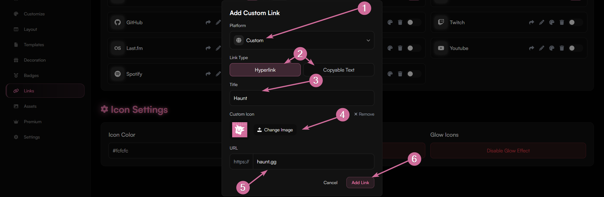
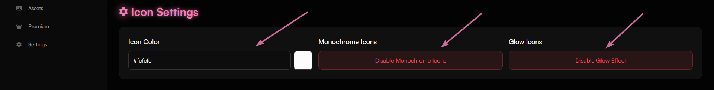
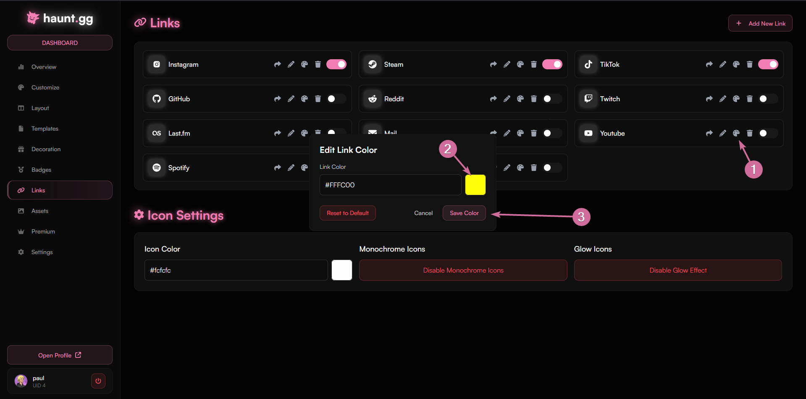
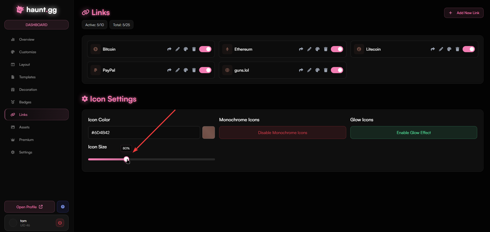

## How to add a link?

<Steps>
    <Step title="Access Links Page">
        Head over to [haunt.gg/dashboard/links](https://haunt.gg/dashboard/links) and click on `Add New Link`.
    </Step>
    <Step title="Choose Your Platform">
        Once you choose which platform to add, you can either select `Hyperlink` to add a URL or `Copyable Text` to add your username for people to copy.
    </Step>
    <Step title="Add Link">
        Once you pasted the link or username, click on `Add Link` and you're done!
    </Step>
</Steps>

<Frame>
    
</Frame>

## How to add a custom link?

<Steps>
    <Step title="Access Links Page">
        Head over to [haunt.gg/dashboard/links](https://haunt.gg/dashboard/links) and click on `Add New Link`.
    </Step>
    <Step title="Choose Custom Platform">
        On the platform option, choose `Custom`.
    </Step>
    <Step title="Change Settings and Add Link">
        You can customize all settings, like title, icon, and URL.
        It is also possible to use copyable text, like with regular links.
        Once you pasted the link or text, click on `Add Link` and you're done!
    </Step>
</Steps>

<Frame>
    
</Frame>

## How to customize link icons?

### Edit settings for all links
    In the same location where you add your links, you can see the `Icon Settings`.
    Here you can change the icon color, make the icons monochrome, and add a glow effect.

<Frame>
    
</Frame>

### Edit color for each link individually
    If you want to have different colors for each link, you have to have the monochrome effect disabled.
    You can then click on the color palette icon to change the icon color.
    The color can be reset to the default one at all times.

<Frame>
    
</Frame>

### Control icon size
    You can adjust the size of all your link icons using the `Icon Size` slider in the Icon Settings section.
    The slider allows you to scale your icons from 50% to 150%, with the percentage value showing the current size.
    This affects all icons uniformly, giving your profile a consistent appearance.

<Frame>

</Frame>

## Supported Link Platforms

<Expandable title="list of supported link platforms">
    - Snapchat
    - Youtube
    - Discord (Server)
    - Discord (User)
    - Spotify
    - Instagram
    - X (Twitter)
    - TikTok
    - Telegram
    - SoundCloud
    - PayPal
    - GitHub
    - GitLab
    - Twitch
    - Kick
    - Reddit
    - LinkedIn
    - Steam
    - Pinterest
    - Last.fm
    - Facebook
    - Patreon
    - Genius
    - OnlyFans
    - Roblox
    - Roblox Group
    - NameMC
    - Stats.fm
    - Labynet
    - Bitcoin
    - Litecoin
    - Ethereum
    - Solana
    - Mail
    - Custom
</Expandable>