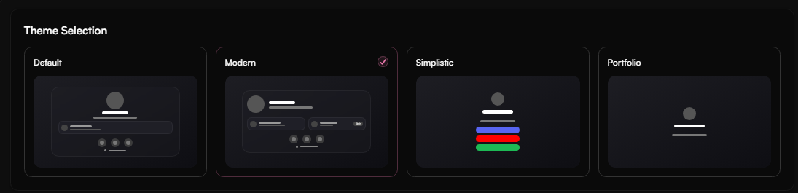
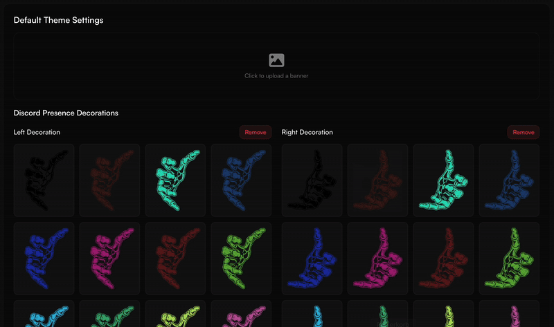
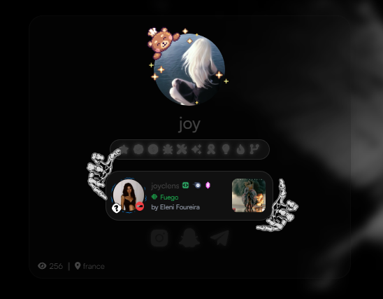
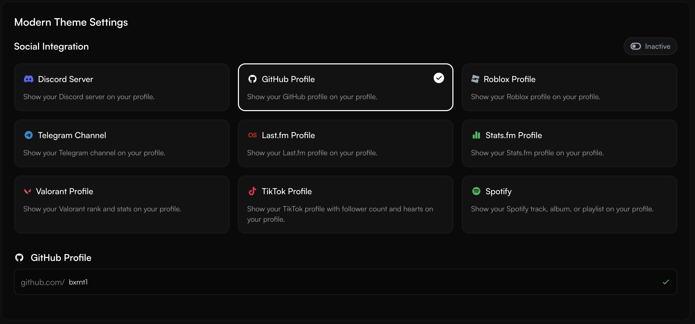
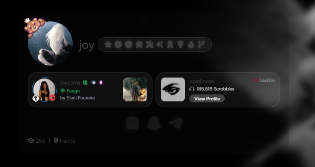
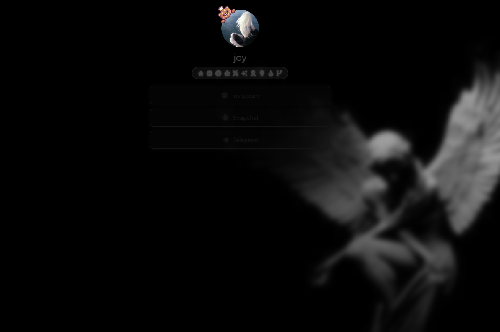

<Card title="Default Theme" icon="circle-1" href="../customization/themes#default-theme" horizontal>
Get information about the default theme.
</Card>

<Card title="Modern Theme" icon="circle-2" href="../customization/themes#modern-theme" horizontal>
Get information about the modern theme.
</Card>

<Card title="Simplistic Theme" icon="circle-3" href="../customization/themes#simplistic-theme" horizontal>
Get information about the simplistic theme.
</Card>

Themes control the **visual layout and structure** of your profile. You can choose from three unique designs to match your personal style; to get started, head to [**haunt.gg/dashboard/layout**](https://haunt.gg/dashboard/layout) and choose from:

- `Default`
- `Modern`
- `Simplistic`

<Frame caption="Theme Selection Page">
  
</Frame>

---

## Default Theme

The **Default** layout is the most customizable option.

### Features

- Upload a **Profile Banner**
- Choose from **15 social cards**

<Frame caption="Default Theme Configuration">
  
</Frame>

## Default Theme Preview:

<Frame caption="Default Theme Preview">
  
</Frame>

---

## Modern Theme

The **Modern** theme offers a sleek, minimalistic design that focuses on social presence.

### Supported Social Integrations

You can select up to **four** of the following:

- Discord Server
- GitHub Profile
- Roblox Profile
- Telegram Channel
- Last.fm Profile
- Stats.fm Profile
- Valorant Profile
- TikTok Profile
- X (Twitter) Profile
- Steam Profile
- Spotify Profile
- Discord Bot Profile
- YouTube Profile
- Twitch Profile
- Minecraft Server
- Clash of Clans Profile/Clan
- Brawl Stars Profile/Clan
- Weather

<Frame caption="Modern Theme Configuration Options">
  
</Frame>

<Info>
You can reorder your social cards however you like.
</Info>

## Modern Theme Preview:

<Frame caption="Modern Theme Preview">
  
</Frame>

---

## Simplistic Theme

The **Simplistic** theme provides a clean, content-focused look.

- No additional configuration options
- Great for text-focused profiles or low-distraction layouts

## Simplistic Theme Preview

<Frame caption="Simplistic Theme Example">
  
</Frame>

---

## Tips for Choosing

<Checklist>
  <Check>Use **Default** if you want banners and Discord presence details</Check>
  <Check>Use **Modern** to highlight a single platform or social profile</Check>
  <Check>Use **Simplistic** for a clean, distraction-free aesthetic</Check>
</Checklist>

<Note>
You can switch between themes anytime. Your content remains the same — only the layout changes!
</Note>
