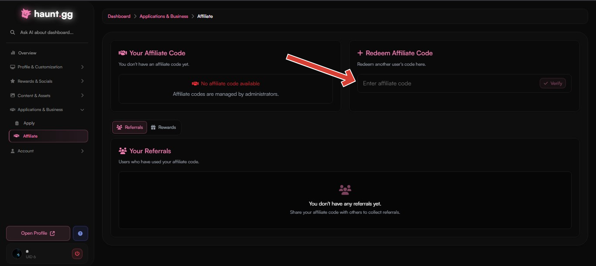

<Card title="Redeem Affiliate Code" icon="circle-1" href="../guides/affiliate#redeem-affiliate-code" horizontal>
Learn how to redeem an affiliate code.
</Card>

<Card title="Apply For Affiliate Program" icon="circle-2" href="../guides/affiliate#apply-for-affiliate-program" horizontal>
Learn how to apply for the affiliate program on haunt.gg.
</Card>

<Card title="Affiliate Program Rewards" icon="circle-3" href="../guides/affiliate#affiliate-program-rewards" horizontal>
Check out all the rewards you can earn as an affiliate.
</Card>

## Redeem affiliate code

<Steps>
    <Step title="Open the Dashboard">  
        Visit [haunt.gg/dashboard](https://haunt.gg/dashboard).
    </Step>  

    <Step title="Go to the Affiliate Section">  
        Go to the [**Affiliate** section](https://haunt.gg/dashboard/affiliate) under **Applications & Business**.
    </Step> 

    <Step title="Redeem Code">  
        Locate the **Redeem Affiliate Code** box, enter the code you want to use, and click **Verify**.

        <Frame>
  
</Frame>

        <Warning>
            You can only redeem one affiliate code.
        </Warning>
    </Step> 

    <Step title="All Set">  
        Once the code is verified as valid, you're all set!

        <Warning>
            If you see **Invalid affiliate code**, double-check for typos or confirm the code is still active.
        </Warning>
    </Step> 
</Steps>

## Apply for Affiliate Program

<Warning>  
Make sure you have:  
- A Discord server with at least **1,000 members**  
- An **active** community  
</Warning>

<Steps>  
    <Step title="Open the Dashboard">  
        Go to [haunt.gg/dashboard](https://haunt.gg/dashboard).
    </Step>  
    <Step title="Go to the Apply Section">  
        Go to the [**Apply** section](https://haunt.gg/dashboard/apply).
    </Step>  
    <Step title="Open the Affiliate Application">  
        Open the application form for the **Affiliate Program**, or click [here](https://haunt.gg/dashboard/apply/8).
    </Step>  
    <Step title="Submit Your Application">  
        Click on **Submit Application** to complete the process.
        </Step>

        <Step title="Be patient">  
        Please be patient while we review your application. Our team needs time to carefully review each submission. 
        <Note>  
        - Haunt’s managers may reject your application or revoke your referral code at any time.  
        - Meeting the requirements does **not** guarantee acceptance.  
        </Note> 
    </Step>  
</Steps>

## Affiliate Program Rewards

| Referred Users | Reward                                                                 |
|----------------|------------------------------------------------------------------------|
| 5+             | [Inviter Badge](https://help.haunt.gg/customization/badges#inviter-badge)   |
| 10+            | [Custom Badge](https://help.haunt.gg/customization/badges#custom-badges)    |
| 25+            | [Premium](https://help.haunt.gg/guides/premium#premium-features)           |
| 50+            | [Verified Badge](https://help.haunt.gg/customization/badges#verified-badge) |

<Note>
    Visit the [Affiliate section on the dashboard](https://haunt.gg/dashboard/affiliate) to see how many people have used your affiliate code. Click on **Rewards** to redeem your rewards.
</Note>

