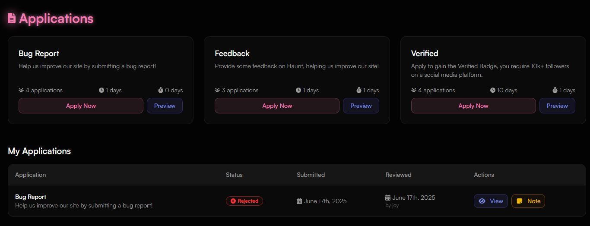
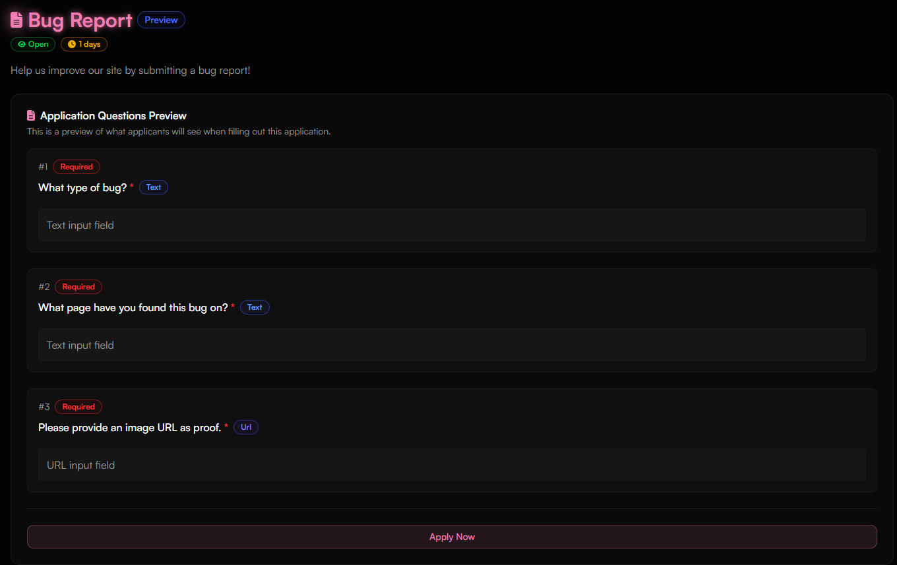

## How do I access my applications?

<Steps>
  <Step title="Go to Applications">
    Visit [https://haunt.gg/dashboard/apply](https://haunt.gg/dashboard/apply) to see all the applications submitted to your profile.
  </Step>
</Steps>

## Overview

The **Applications dashboard** displays all your incoming requests. Each row typically shows:

- Application title and category  
- Submission timestamp  
- Application status (Pending, Accepted, Rejected)  
- Quick actions like previewing, applying

<Frame>
  
</Frame>

---

## Form Preview

Each application type—such as bug reports, verification status, or feedback—can be previewed before applying. This preview outlines the required fields and form layout.

The preview may include:

- Application title and status (e.g., “Open”)  
- Account age requirements (e.g., “1 days remaining”)  
- All required questions with the input type (text, URL, etc.)  
- Optional context or category labels  

<Frame>
  
</Frame>

<Note>
Use the **Preview** button before applying to review the form's full structure and ensure you have everything ready.
</Note>

---

## Review Note

If a submission is rejected or accepted, a **note** may be given. Clicking this button will show any note(s) written.

<Frame>
  
</Frame>

<Note>
Review Notes don’t impact a user’s status—they’re just informational.
</Note>

---

