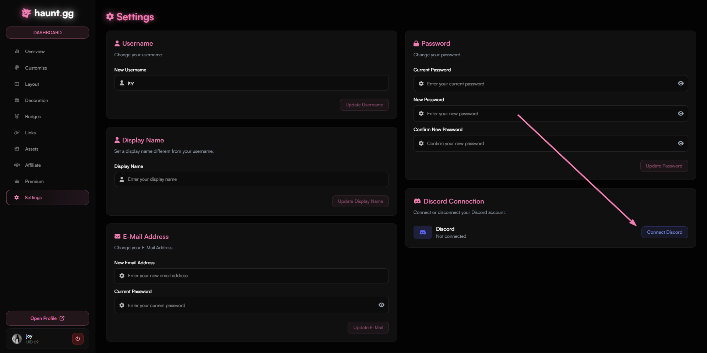
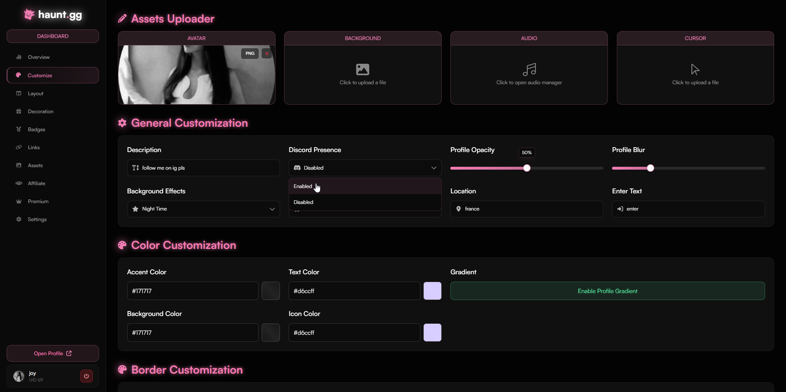
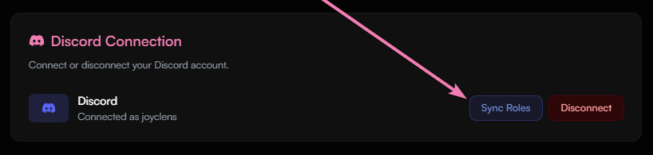

## Linking your Discord Account

1. Head over to [haunt.gg/dashboard/settings](https://haunt.gg/dashboard/settings)
2. Click on the **Connect Discord** button
3. You're all done, you're now linked to haunt!

## Enabling your Discord Presence

1. After you've linked your Discord Account, head over to [haunt.gg/dashboard/customize](https://haunt.gg/dashboard/customize)
2. On the "Discord Presence" dropdown, choose "Enabled", and then press **Save Changes**
3. You're all done, your discord presence is now on your page!

## Claiming your Discord Roles in haunt's server

1. Firstly, ensure that you are **linked** to haunt, if you aren't, use the steps above.
2. You can use the command: `/user sync` in the designated channel.
   - Or, head over to [haunt.gg/dashboard/settings](https://haunt.gg/dashboard/settings) and press the "Sync Roles" button!

