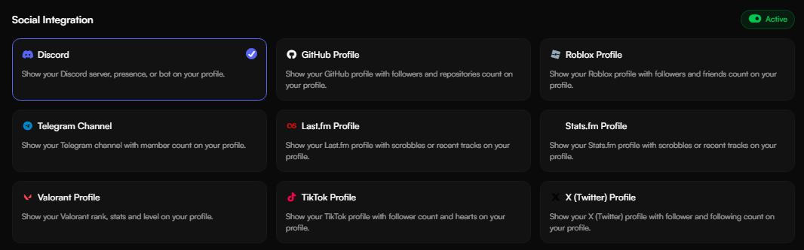
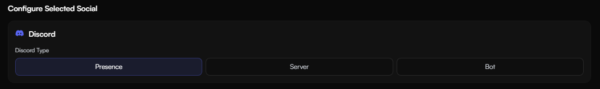
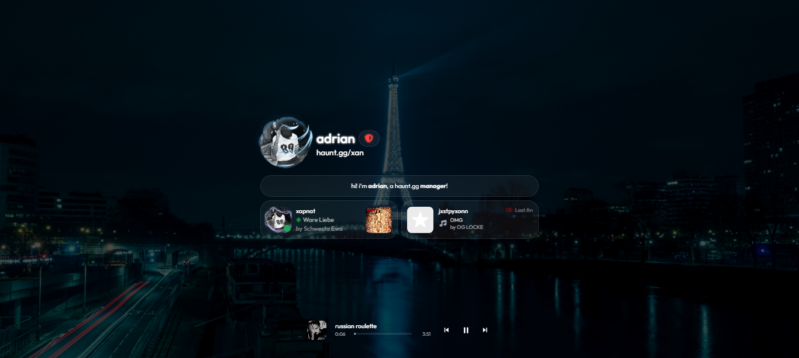

<Card title="Linking your Discord Account" icon="circle-1" href="../guides/discord#linking-your-discord-account" horizontal>
Learn how to link your discord account to your profile.
</Card>

<Card title="Enabling your Discord Presence" icon="circle-2" href="../guides/discord#enabling-your-discord-presence" horizontal>
Learn how to enable your discord presence on your profile.
</Card>

<Card title="Claim your Discord Roles on haunt.gg server" icon="circle-3" href="../guides/guides/discord#claiming-your-discord-roles-on-haunt’s-server" horizontal>
Learn how to claim your discord roles on the haunt.gg discord server.
</Card>

## Linking your Discord Account

<Steps>
    <Step title="Navigate to Settings">
        Head over to [haunt.gg/dashboard/settings](https://haunt.gg/dashboard/settings)
    </Step>
    <Step title="Connect Discord">
        Click on the **Connect Discord** button
    </Step>
    <Step title="Complete Setup">
        You're all done, you're now linked to haunt!
    </Step>
</Steps>

<Frame>
    
</Frame>

---

## Enabling Your Discord Presence

<Steps>
    <Step title="Access Layout Page">
        After linking your Discord account, go to [haunt.gg/dashboard/layout](https://haunt.gg/dashboard/layout).
    </Step>
    <Step title="Select Discord">
        Click on the **Discord** social card. This works for both the default and modern themes.

        <Frame>
    
</Frame>

    </Step>
    <Step title="Choose Presence">
        Scroll down and select **Presence**. Make sure the social cards are turned on in the top right corner.

        <Frame>
    
</Frame>

    </Step>

    <Step title="Done">
        That’s it — you’re all set!
    </Step>
</Steps>

<Frame>
    
</Frame>

---

## Claiming your Discord roles on haunt's server

<Steps>
    <Step title="Verify Account Link">
        Firstly, ensure that you are **linked** to haunt, if you aren't, use the steps above.
    </Step>
    <Step title="Use Sync Command">
        You can use the command: `/user sync` in the designated channel.
    </Step>
    <Step title="Alternative: Dashboard Sync">
        Or, head over to [haunt.gg/dashboard/settings](https://haunt.gg/dashboard/settings) and press the "Sync Roles" button!
    </Step>
</Steps>

<Frame>
    
</Frame>