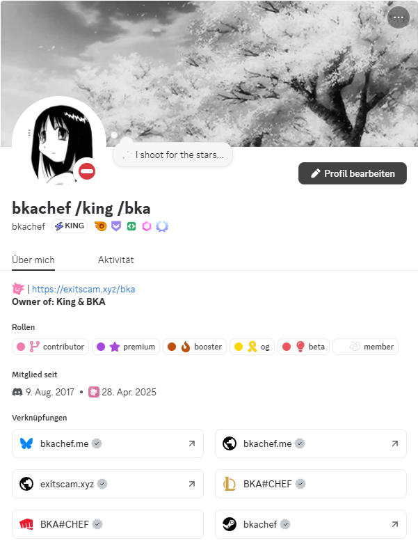
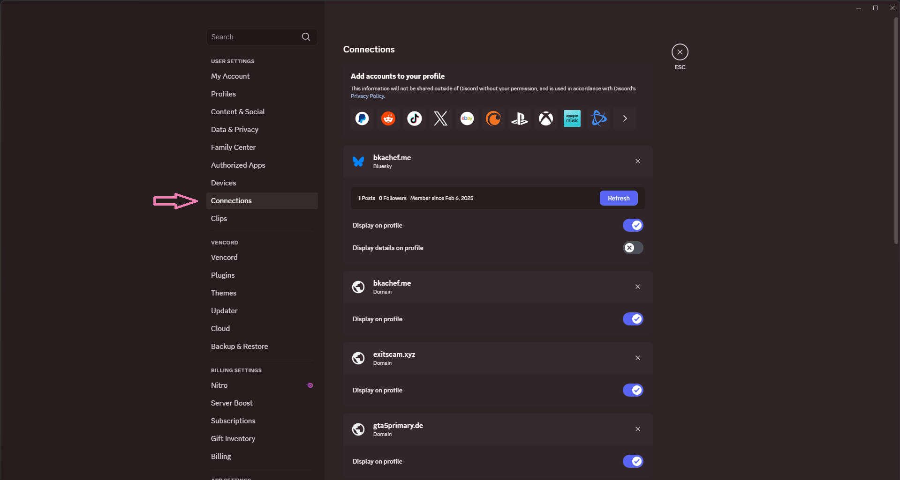
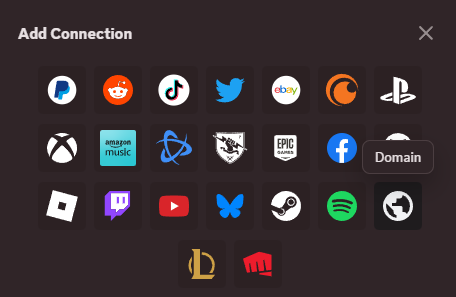
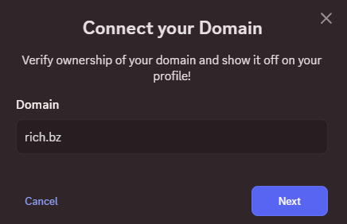
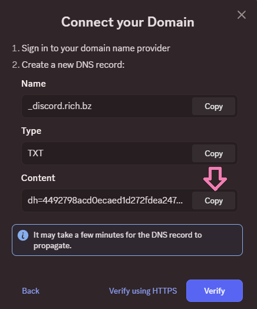
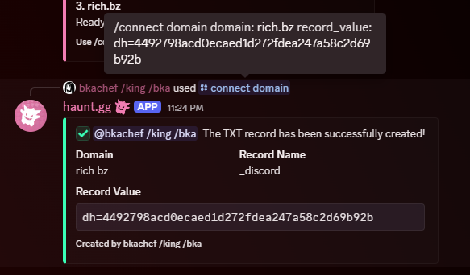
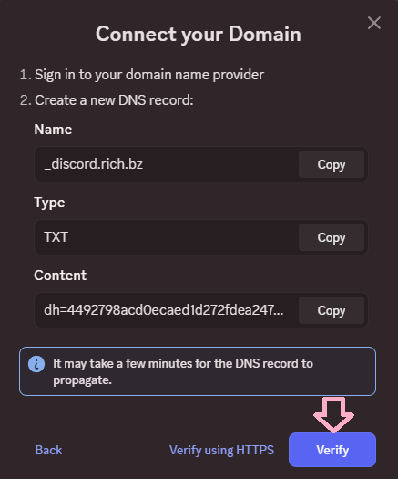
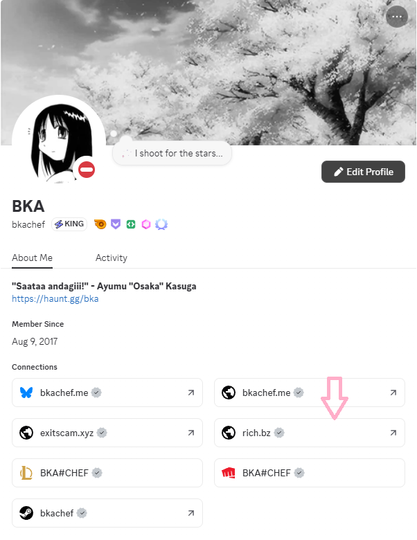

## What domains are Available Right now?

- These are the domains that are available and ready to use: [haunt.gg](https://haunt.gg/), [exitscam.xyz](https://exitscam.xyz/), [fentanyl.ing](https://fentanyl.ing), [rich.bz](https://rich.bz/), [haunt.bio](https://haunt.bio/)

## How can I use those domains?

- You just need to choose your preferred domain name and add your username after the slash (Example: [https://exitscam.xyz/bka](https://exitscam.xyz/bka)) then you can add them to everything you want, like your Discord description!

<Frame>
    
</Frame>

## How can I link the domain to my Discord?

<Steps>
    <Step title="Go to your Discord Settings">
        Go to your Settings and then click on connections
        <Frame>
            
        </Frame>
    </Step>
    <Step title="Add a Domain Connection">
        Click on the right arrow and click on the globe button!
        <Frame>
            
        </Frame>
    </Step>
    <Step title="Enter the Domain that you want">
        Enter your preferred domain (we are using rich.bz for our example) and then click on next
        <Frame>
            
        </Frame>
    </Step>
    <Step title="Copy the Content">
        Copy the content that you see on the next page
        <Frame>
            
        </Frame>
    </Step>
    <Step title="Head to the Haunt.gg Discord">
        Head to the Haunt.gg Discord and then click on the cmds channel and then enter the command: /connect domain [Domain] [Record_Value] | The Record_Value is the content that you Copied!
        <Frame>
            
        </Frame>
    </Step>
    <Step title="Head back to your Settings">
        Head back to your Connections Settings and enter the domain again, and then click on Verify. (If it doesn't work the first time, try it again in a few minutes!) 
        <Frame>
            
        </Frame>
    </Step>
</Steps>

- If it's linked, then it should look like this:

<Frame>
    
</Frame>

## How can I donate my domain to the Haunt.gg Team?

<Note>
   Make a ticket in the [Discord](discord.gg/hauntbio) to donate a domain.
</Note>
