<div className="mobile-only">
<Card title="Access Imagehost" icon="circle-1" href="../guides/imagehost#how-do-i-access-the-image-host%3F" horizontal>
Learn how to access the imagehost.
</Card>

<Card title="General Customization" icon="circle-2" href="../guides/imagehost#general-customization" horizontal>
Learn how to customize the imagehost.
</Card>

<Card title="Domains" icon="circle-3" href="../guides/imagehost#domains" horizontal>
Check out all available imagehost domains.
</Card>

<Card title="Setup Upload Clients" icon="circle-4" href="../guides/imagehost#setup-upload-clients" horizontal>
Learn how to setup an upload client.
</Card>

<Card title="Discord Embed Customization" icon="circle-5" href="../guides/imagehost#discord-embed-customization" horizontal>
Learn how to customize the discord embed for imagehost links.
</Card>

<Card title="Upload An Image" icon="circle-6" href="../guides/imagehost#upload-an-image" horizontal>
Learn how to upload an image to the imagehost.
</Card>

<Card title="View Uploaded Images" icon="circle-7" href="../guides/imagehost#view-uploaded-images" horizontal>
Learn how to access your uploaded images.
</Card>

<Card title="Limits" icon="circle-8" href="../guides/imagehost#limits" horizontal>
Check out the imagehost limits.
</Card>
</div>

## How do I access the Image Host?

<Steps>
  <Step title="Open the Dashboard in the Image Host section">
    Visit [haunt.gg/dashboard/imagehost](https://haunt.gg/dashboard/imagehost/overview).
  </Step>
</Steps>

## General Customization

<Steps>
  <Step title="Scroll down">
    Scroll down the page until you see the "General Customization" section.
  </Step>
  <Step title="Start customizing">
    You'll find various customization options such as domain, auto deletion, anonymous uploads, and more.
  </Step>
</Steps>

<Frame>
  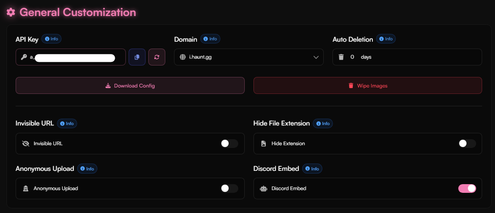
</Frame>

<Tip>
If you're unsure about the purpose of a specific option, hover over the info icon for more details.
</Tip>

<Info>
To view the list of available domain options, click [here](../guides/imagehost#supported-domains).
</Info>

<Danger>
Never share your API key with anyone — it could allow others to upload images on your behalf.
</Danger>

## Domains

<Accordion title="Supported Domains">

<Info>
<Icon icon="square-s" size="1em" /> means that this domain supports subdomains.
</Info>

- i.haunt.gg  
- i.rich.bz
- i.exitscam.xyz
- i.fentanyl.ing
- i.haunt.bio
- i.best-bio.site
- 361.reaszy.com
- zleni.xyz <Icon icon="square-s" size="1em" />  
- bxrnt.live <Icon icon="square-s" size="1em" />  
- haunt.host <Icon icon="square-s" size="1em" />
- haunt.pics <Icon icon="square-s" size="1em" />
- haunt.ink <Icon icon="square-s" size="1em" />
- carti.pics <Icon icon="square-s" size="1em" />
- e-sex.today <Icon icon="square-s" size="1em" />
- haunt.edu.pl <Icon icon="square-s" size="1em" />
- is-handso.me <Icon icon="square-s" size="1em" />
- kill-yourself.lol <Icon icon="square-s" size="1em" />
- mrak.me <Icon icon="square-s" size="1em" />
- nitro.rest <Icon icon="square-s" size="1em" />
- syra.systems <Icon icon="square-s" size="1em" />
- storagevault.cloud <Icon icon="square-s" size="1em" />
- slime.rest <Icon icon="square-s" size="1em" />
- i-love-your.mom <Icon icon="square-s" size="1em" />
- luvs.cat <Icon icon="square-s" size="1em" />
- buy-slav.es <Icon icon="square-s" size="1em" />
</Accordion>

<Tip>
If you’d like to suggest a domain, [join our Discord server](https://discord.gg/hauntbio). To donate a domain, please open a ticket in the server, as thank you, you get the Donator badges.
</Tip>


## Upload Client

<Steps>
  <Step title="Download Config">
    Click the "Download Config" button to download the configuration file for your upload client.
  </Step>
</Steps>

<Accordion title="Supported Upload Clients">
- ShareX (Windows)  
- iShare (macOS)  
- Shortcuts (iOS)  
- Flameshot (Linux)
</Accordion>

### Setup Upload Clients

<Tabs>

  <Tab title="ShareX" icon="https://getsharex.com/img/ShareX_Logo_White_Transparent.png">

<Accordion title="Download ShareX">
Download the latest **ShareX** version [here](https://getsharex.com/).
</Accordion>

<Steps>

<Step title="Download Config File">
Visit [haunt.gg/dashboard/imagehost/overview](https://haunt.gg/dashboard/imagehost/overview), click the **"Download Config"** button, select **ShareX**, and download the file.

<Info>
Every time you regenerate your API key, you need to either download the configuration file again **or** manually update the API key in the ShareX application.
</Info>

</Step>

<Step title="Open File">
Open the downloaded **.sxcu** file.

<Frame>
  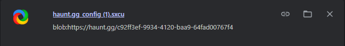
</Frame>
</Step>

<Step title="Confirm">
A confirmation dialog will appear. Click **Yes** to import the config.

<Frame>
  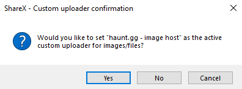
</Frame>
</Step>

<Step title="Done">
That's it! You can now take screenshots using the keyboard shortcuts listed on the start page.

<Frame>
  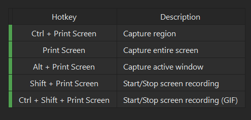
</Frame>
</Step>

</Steps>

<Accordion title="Make Sure Everything Works">

<Steps>

<Step>
Enable **"Upload image to host"** under **After capture tasks**.

<Frame>
  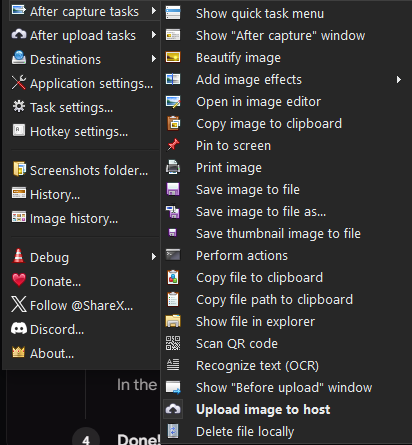
</Frame>
</Step>

<Step>
Enable **"Copy URL to clipboard"** under **After upload tasks**.

<Frame>
  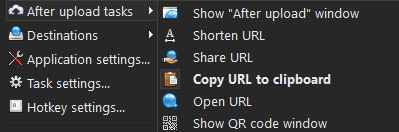
</Frame>
</Step>

<Step>
Go to **Destinations → Image uploader** and make sure **Custom image uploader** is selected.

<Frame>
  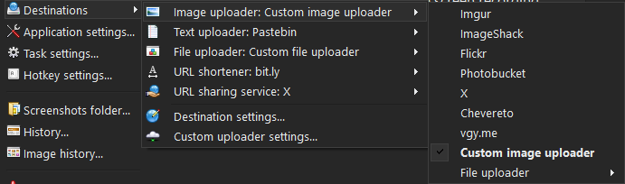
</Frame>
</Step>

</Steps>

</Accordion>

</Tab>

<Tab title="iShare" icon="crop-simple">

<Accordion title="Download iShare">
Download the latest **iShare** version [here](https://github.com/itoolio/ishare/releases).

<Frame>
  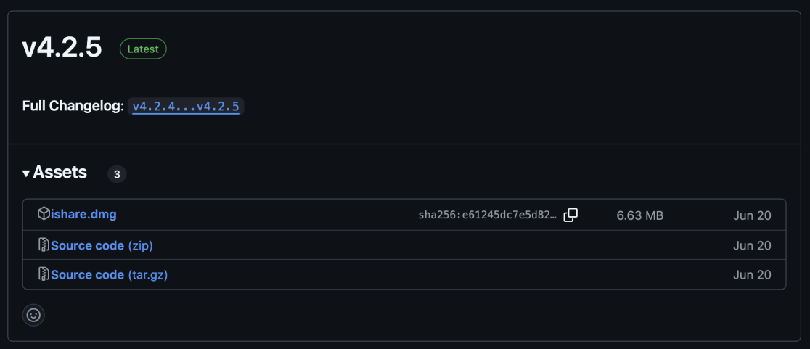
</Frame>
</Accordion>

<Steps>

<Step title="Download Config File">
Download the iShare config file from [here](https://haunt.gg/dashboard/imagehost/overview).
</Step>

<Step title="Open iShare">
Open iShare and go to **Uploaders**, then click **Import**.
</Step>

<Step title="Drag File">
Drag the downloaded **.iscu** file into the import box.

<Frame>
  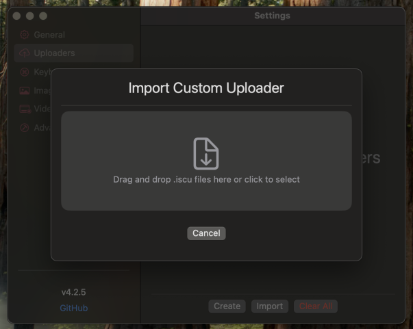
</Frame>
</Step>

<Step title="Done">
That's it! You can now take screenshots using the keyboard shortcuts listed on the start page.

<Frame>
  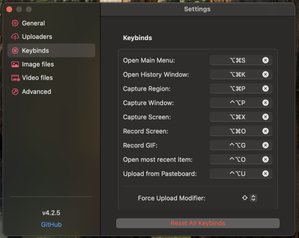
</Frame>
</Step>

</Steps>

<Accordion title="Make Sure Everything Works">

<Steps>

<Step>
At the top of your desktop, locate the image icon. Make sure that under **Post Media Tasks**, **Upload Media** is enabled.

<Frame>
  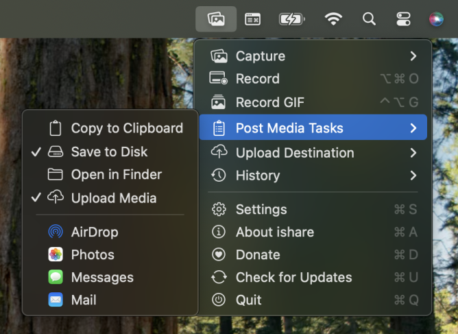
</Frame>
</Step>

<Step>
Under **Upload destination**, make sure **haunt.gg - image host** is selected.

<Frame>
  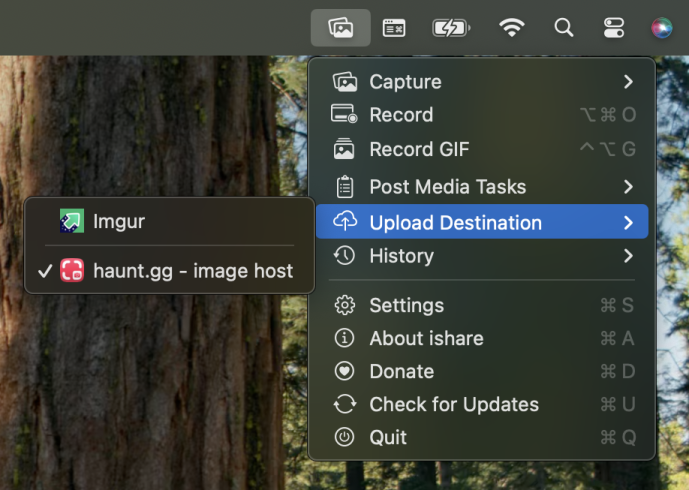
</Frame>
</Step>

</Steps>

</Accordion>

</Tab>


  <Tab title="Shortcuts" icon="apple">

<Steps>

<Step title="Download Shortcut">
Click [here](https://www.icloud.com/shortcuts/6426a03bb2d746dc8eb1c2c2f2ef7dff) to download the iOS shortcut.
</Step>

<Step title="Set Up Shortcut">
Tap the blue **"Set Up Shortcut"** button.
</Step>

<Step title="Configure API Key">
In the next step, enter your API key, which you can find [here](https://haunt.gg/dashboard/imagehost/overview) in the text field.
</Step>

<Step title="Done!">
Tap the blue **"+"** button — your shortcut is now ready! It will automatically upload the **latest image** from your photo library.
</Step>

</Steps>

<Frame>
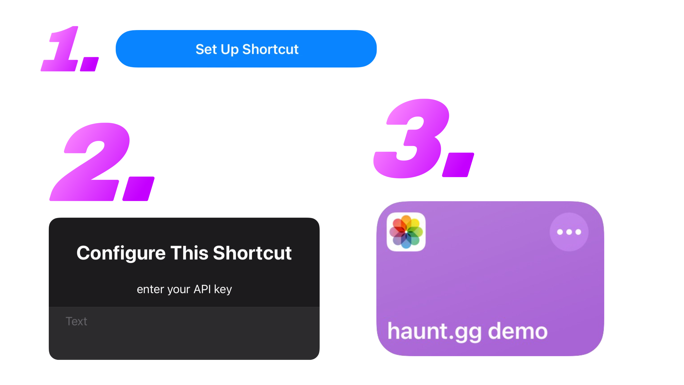
</Frame><br/><br/>

<Accordion title="Add Shortcut to Control Center">

<Steps>

<Step title="Add a Control">
Open Control Center and long-press on an empty area. You should see a **"+ Add a Control"** button — tap it. Alternatively, tap the **"+"** at the top left.
</Step>

<Step title="Select Shortcut">
Search for the **"Shortcut"** control, then choose the upload shortcut.
</Step>

<Step title="Done">
You can now place the shortcut wherever you like in your Control Center.
</Step>

</Steps>

<Frame>
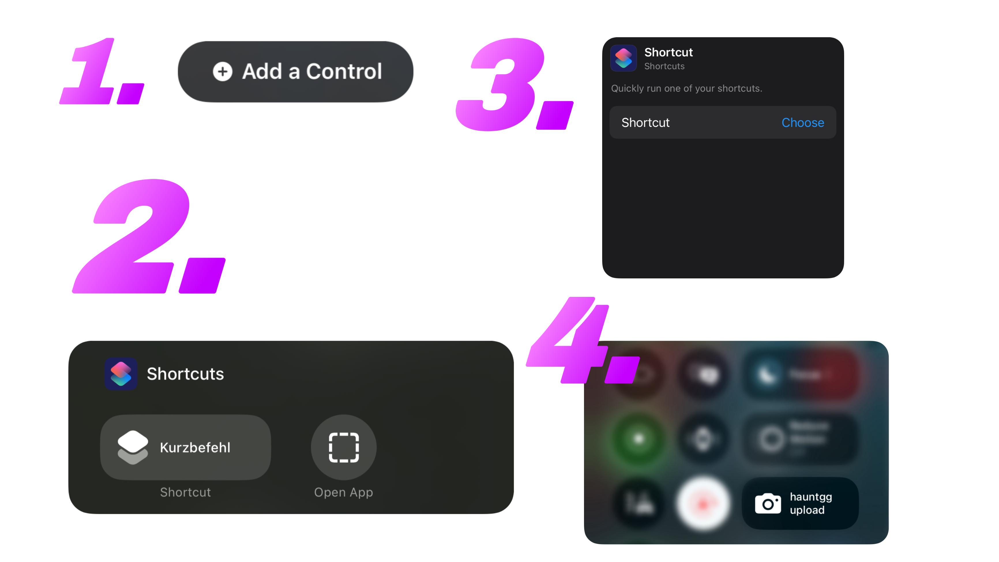
</Frame>

</Accordion>

<Accordion title="Upload Image Using Share Sheet">

<Steps>

<Step title="Open Shortcut Settings">
Open the shortcut and tap the blue **"i"** button at the bottom.
</Step>

<Step title="Enable in Share Sheet">
Find and enable the **"Show in Share Sheet"** option.
</Step>

<Step title="Done">
You can now upload images directly via the iOS share sheet.
</Step>

</Steps>

<Frame>
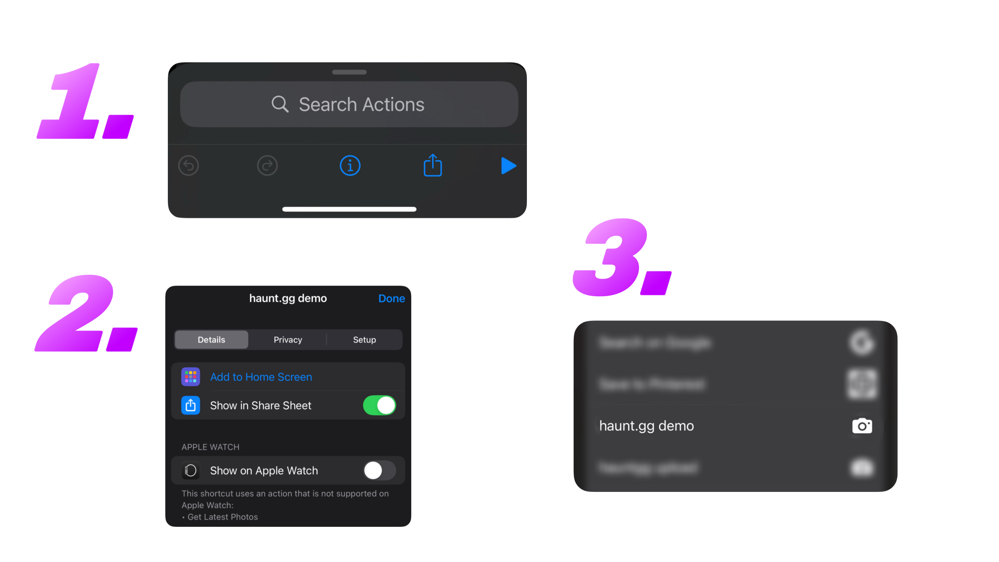
</Frame>

</Accordion>

<Accordion title="Upload Image from Clipboard">

<Steps>

<Step title="Open Shortcut">
Open the shortcut.
</Step>

<Step title="Modify Element">
Locate the **"Convert latest photo to PNG"** element. Tap and hold the **"Latest Photo"** text (highlighted in blue).
</Step>

<Step title="Select Clipboard">
Tap **"Clipboard"**. Now, the shortcut will use the image from your clipboard — e.g., by choosing **"Copy & Delete"** from the iOS screenshot menu.
</Step>

</Steps>

<Frame>
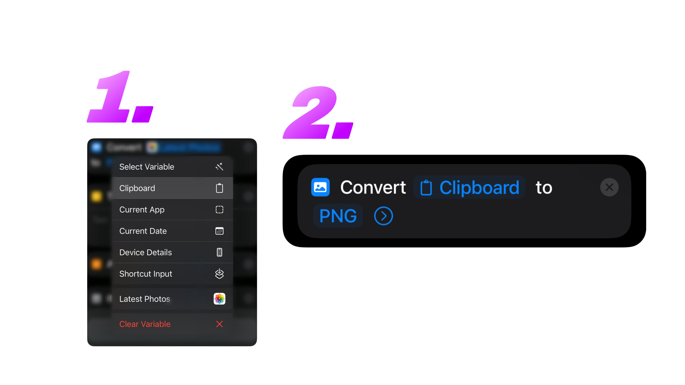
</Frame>

</Accordion>

</Tab>

  <Tab title="Flameshot" icon="fire-flame-curved">

<Accordion title="Install Flameshot">
Install **Flameshot** using your distribution's package manager:

<Tabs>
  <Tab title="Ubuntu/Debian">
    ```bash
    sudo apt install flameshot
    ```
  </Tab>
  <Tab title="Fedora">
    ```bash
    sudo dnf install flameshot
    ```
  </Tab>
  <Tab title="Arch Linux">
    ```bash
    sudo pacman -S flameshot
    ```
  </Tab>
  <Tab title="Other Distributions">
    Check [Flameshot's GitHub releases](https://github.com/flameshot-org/flameshot/releases) for additional installation methods or use your distribution's package manager.
  </Tab>
</Tabs>
</Accordion>

<Steps>

<Step title="Download Config Script">
Visit [haunt.gg/dashboard/imagehost/overview](https://haunt.gg/dashboard/imagehost/overview), click the **"Download Config"** button, select **Flameshot**, and download the script file.

<Info>
The downloaded file will be a `.sh` script that handles screenshot capture and upload automatically.
</Info>

</Step>

<Step title="Make Script Executable">
Open a terminal and navigate to where you downloaded the script, then make it executable:

<Info>
It's **recommended** to create a dedicated directory for the script in your home folder for better organization:
```bash
mkdir -p ~/haunt
mv haunt.gg_config.sh ~/haunt/
cd ~/haunt
```
</Info>

```bash
chmod +x haunt.gg_config.sh
```

<Frame>
  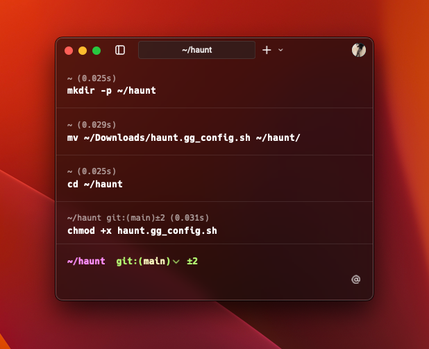
</Frame>
</Step>

<Step title="Install Required Dependencies">
The script requires `jq`, `curl`, and `xclip`. Install them if not already present:

<Tabs>
  <Tab title="Ubuntu/Debian" icon="ubuntu">
    ```bash
    sudo apt install jq curl xclip
    ```
  </Tab>
  <Tab title="Fedora" icon="redhat">
    ```bash
    sudo dnf install jq curl xclip
    ```
  </Tab>
  <Tab title="Arch Linux" icon="linux">
    ```bash
    sudo pacman -S jq curl xclip
    ```
  </Tab>
  <Tab title="Other Distributions" icon="server">
    Use your distribution's package manager to install:
    - `jq` - JSON processor
    - `curl` - HTTP client  
    - `xclip` - Clipboard utility
  </Tab>
</Tabs>

</Step>

<Step title="Test the Script">
Run the script to test if everything works:

```bash
./haunt.gg_config.sh
```

The Flameshot GUI should open, allowing you to take a screenshot. After capturing, the image URL will be copied to your clipboard and you'll see a notification.

<Frame>
  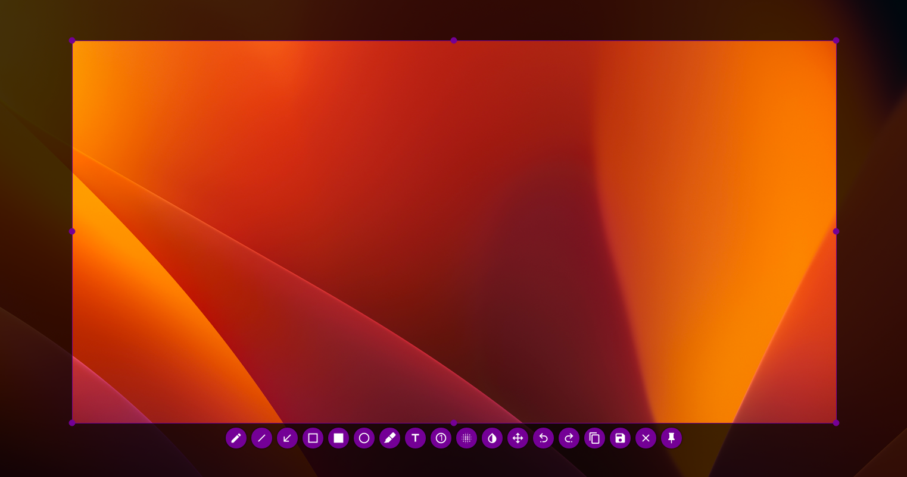
</Frame>
</Step>

<Step title="Set Up Keyboard Shortcut (Optional)">
For convenience, you can set up a keyboard shortcut to run the script:

<Tabs>
  <Tab title="GNOME/Ubuntu" icon="ubuntu">
    1. Open **Settings** → **Keyboard** → **Keyboard Shortcuts**
    2. Click **Custom Shortcuts** or **View and Customize Shortcuts**
    3. Click the **+** button to add a new shortcut
    4. **Name:** `Haunt.gg Screenshot`
    5. **Command:** `~/haunt/haunt.gg_config.sh`
    6. **Shortcut:** Press your desired key combination (e.g., `Ctrl+Shift+S`)
  </Tab>
  
  <Tab title="KDE/Plasma" icon="computer">
    1. Open **System Settings** → **Shortcuts**
    2. Go to **Custom Shortcuts**
    3. Right-click and select **New** → **Global Shortcut** → **Command/URL**
    4. **Name:** `Haunt.gg Screenshot`
    5. Go to **Trigger** tab and set your key combination (e.g., `Ctrl+Shift+S`)
    6. Go to **Action** tab and set **Command:** `~/haunt/haunt.gg_config.sh`
  </Tab>
  
  <Tab title="XFCE" icon="desktop">
    1. Open **Settings** → **Keyboard**
    2. Go to **Application Shortcuts** tab
    3. Click **Add** button
    4. **Command:** `~/haunt/haunt.gg_config.sh`
    5. Press your desired key combination (e.g., `Ctrl+Shift+S`)
  </Tab>
  
  <Tab title="i3/Hyprland/Sway" icon="window-maximize">
    Add this line to your config file:
    
    **i3 (~/.config/i3/config):**
    ```bash
    bindsym $mod+Shift+s exec ~/haunt/haunt.gg_config.sh
    ```
    
    **Hyprland (~/.config/hypr/hyprland.conf):**
    ```bash
    bind = SUPER_SHIFT, S, exec, ~/haunt/haunt.gg_config.sh
    ```
    
    **Sway (~/.config/sway/config):**
    ```bash
    bindsym $mod+Shift+s exec ~/haunt/haunt.gg_config.sh
    ```
  </Tab>
  
  <Tab title="Command Line" icon="terminal">
    You can also run the script directly from terminal:
    ```bash
    ~/haunt/haunt.gg_config.sh
    ```
    
    Or create a shell alias by adding this to your `~/.bashrc` or `~/.zshrc`:
    ```bash
    alias screenshot='~/haunt/haunt.gg_config.sh'
    ```
    
    Then reload your shell and use: `screenshot`
  </Tab>
</Tabs>

</Step>

</Steps>

<Accordion title="Verify Upload Configuration">

<Steps>

<Step title="Check Script Contents">
You can verify your API key and upload URL are correctly configured by viewing the script:

```bash
cat haunt.gg_config.sh
```

Look for these lines:
- `auth="YOUR_API_KEY"` - Should contain your API key
- `url="https://haunt.gg/api/imagehost/upload"` - Should be the upload endpoint
</Step>

<Step title="Test Upload">
Take a test screenshot and verify:
- Screenshot GUI opens properly
- Image uploads successfully
- URL is copied to clipboard
- Notification appears confirming upload
</Step>

<Step title="Troubleshoot Dependencies">
If the script fails, ensure all dependencies are installed:

```bash
which flameshot jq curl xclip
```

All commands should return valid paths.
</Step>

</Steps>

</Accordion>

</Tab>

</Tabs>


## Discord Embed Customization

<Steps>
  <Step title="Scroll down">
    Scroll down the page until you reach the "Embed Settings" section.
  </Step>
  <Step title="Start customizing">
    Customize settings such as the embed author, title, description, and more.
  </Step>
</Steps>

<Frame>
  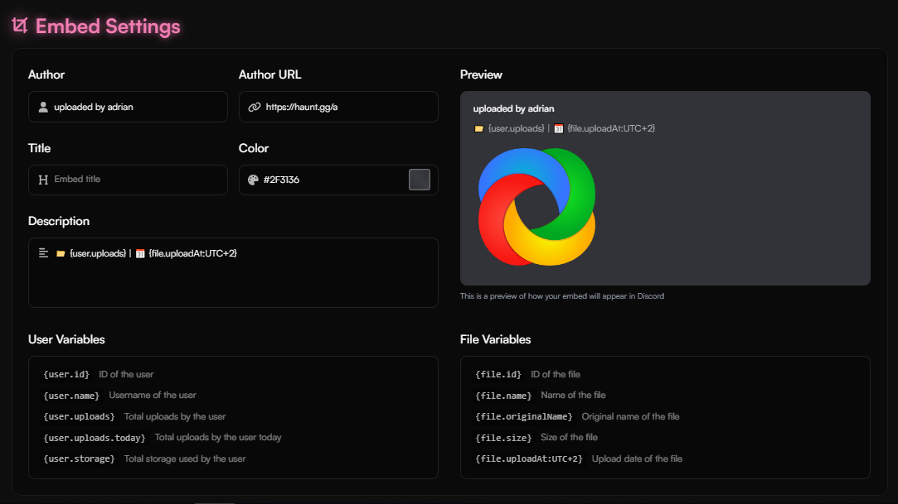
</Frame>

<Info>
At the bottom of the section, you’ll find variables you can use in your embed.
</Info>

## Upload an Image

<Tabs>
  <Tab title="Manual Upload">
    <Steps>
      <Step title="Open the Upload section on the dashboard">
        Visit [haunt.gg/dashboard/imagehost/upload](https://haunt.gg/dashboard/imagehost/upload).
      </Step>
      <Step title="Choose file">
        Click "Click to upload a file" and select your image.
      </Step>
      <Step title="Done">
        Your file is now uploaded! You can copy and share the link.

        <Frame>
          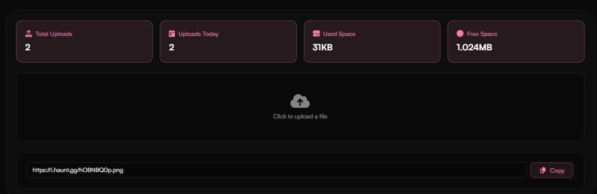
        </Frame>
      </Step>
    </Steps>
  </Tab>
  <Tab title="Upload Client">
    To download the configuration file for your upload client, follow the instructions [here](../guides/imagehost#upload-client).
  </Tab>
</Tabs>

## View Uploaded Images

<Steps>
  <Step title="Open the Gallery section on the dashboard">
    Visit [haunt.gg/dashboard/imagehost/gallery](https://haunt.gg/dashboard/imagehost/gallery).

    <Frame>
      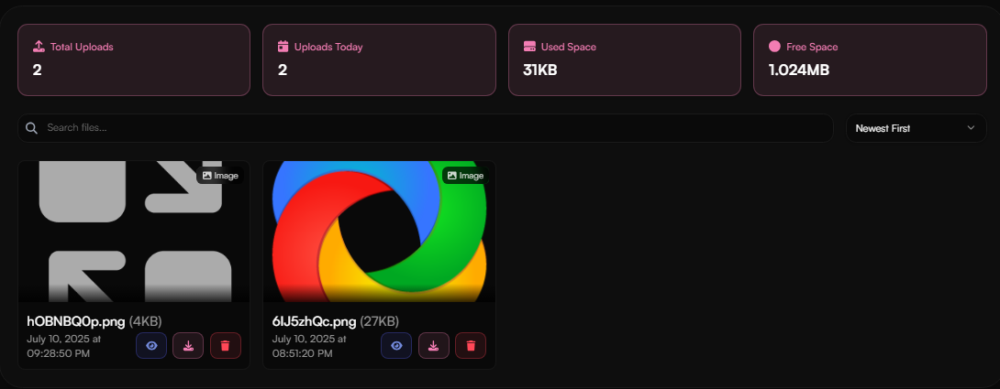
    </Frame>
  </Step>
</Steps>

## Limits

| Feature  | Free               | Premium         |
|----------|--------------------|-----------------|
| Storage  | 1GB (1,024 MB)      | 10GB (10,240MB)   |
