## How to buy Premium on haunt.gg

<Steps>
    <Step title="Go to the pricing page">
        Head over to [haunt.gg/pricing](https://haunt.gg/pricing)
    </Step>
    <Step title="Click on the Buy Button">
        Then click on the button: "Get Lifetime Premium"
    </Step>
    <Step title="Pick your payment method">
        Then pick your preferred payment method
    </Step>
</Steps>

## Payment Methods

<Tabs>
    <Tab title="Stripe">
        - You can choose following payment methods via Stripe: Credit/Debit Card, Google Pay, eps-Transfer (Bank Transfer), Klarna, Apple Pay, Giropay
    </Tab>
    <Tab title="Cryptocurrencies">
        - You can choose the following Cryptocurrencies via Cryptomus: USDT, BTC, LTC, ETH, XMR, POL, BNB, USDC, SOL
    </Tab>
</Tabs>

## Premium Features

<Tabs>
    <Tab title="Alias">
        - You can create an Alias username that automatically redirects you to your main Bio Page
        <Frame>
            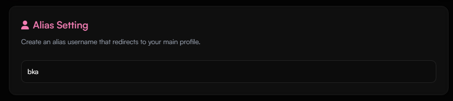
        </Frame>
    </Tab>
    <Tab title="Profile Metadata">
        - You can set your Discord Embed and your Tab-Title and Favicon with the Profile Metadata
        <Frame>
            
        </Frame>
        <Frame>
            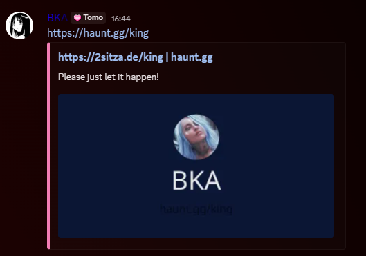
        </Frame>
    </Tab>
    <Tab title="Typewriter Descriptions">
        - You can add Multiple Descriptions to display on your Bio with a Typewriter effect
        <Frame>
            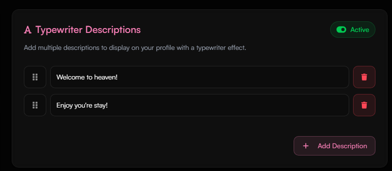
        </Frame>
        <Frame>
            
        </Frame>
    </Tab>
    <Tab title="Cursor Effects">
        - You can add a custom cursor effect that follows your mouse for your Bio
        <Frame>
            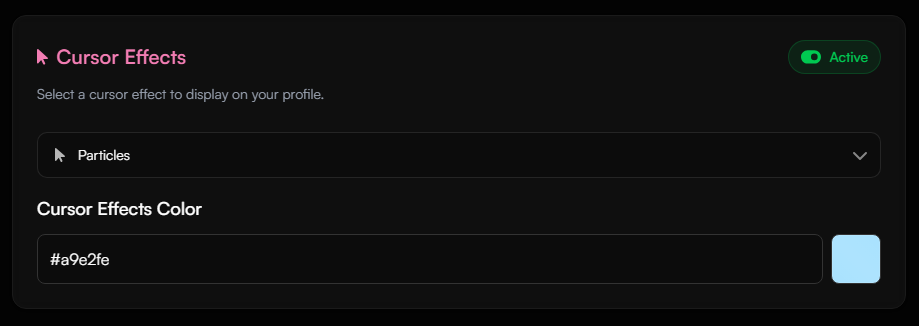
        </Frame>
        <Frame>
            
        </Frame>
    </Tab>
    <Tab title="Font Settings">
        - You can change your font for your bio page (the letters of your name and description).
        <Frame>
            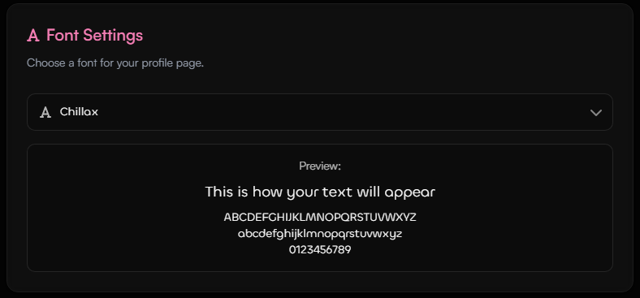
        </Frame>
        <Frame>
            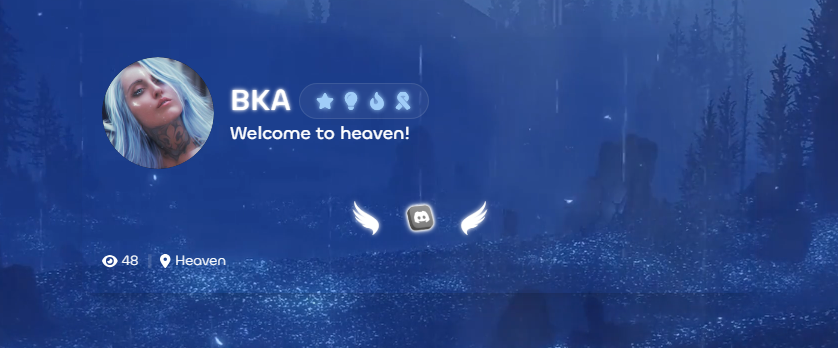
        </Frame>
    </Tab>
    <Tab title="Profile Animation">
        - You can add a custom animation to your Bio page
        <Frame>
            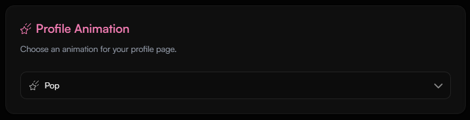
        </Frame>
        <Frame>
            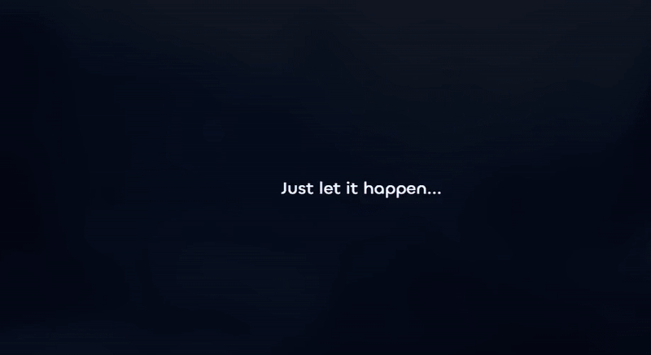
        </Frame>
    </Tab>
    <Tab title="Username Cooldown">
        - You can change your username without a cooldown
        <Frame>
            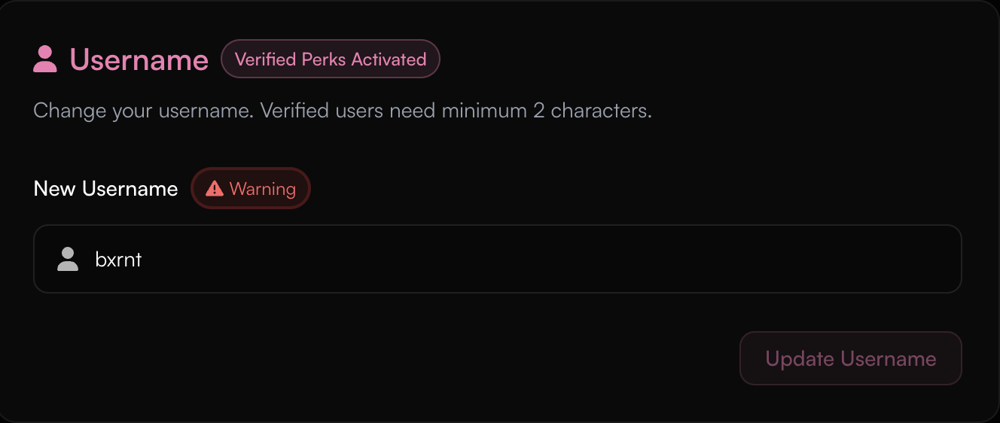
        </Frame>
    </Tab>
    <Tab title="Customizable Border Options">
        - You can update your border's animations
        <Frame>
            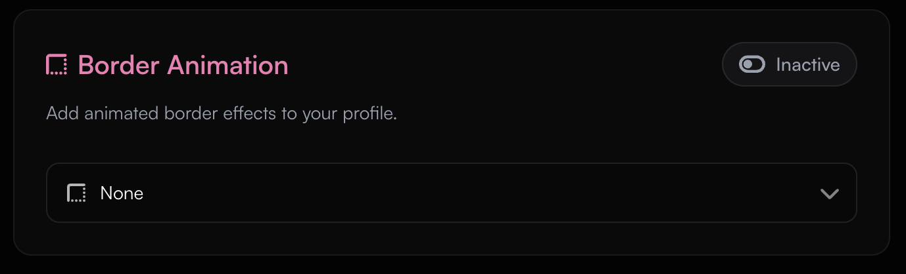
        </Frame>
        <Frame>
            
        </Frame>
    </Tab>
    <Tab title="Custom Fonts">
        - You can update your border's animations
        <Frame>
            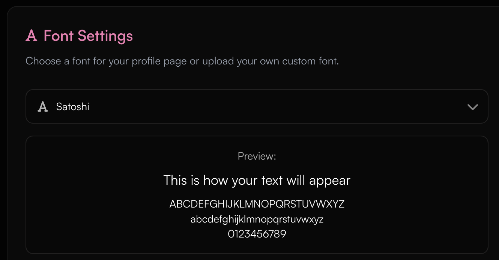
        </Frame>
    </Tab>

</Tabs>

## How do i get the premium rank on the Discord

<Note>
    You can learn more on how to link your rank to Discord in this guide: [Discord Connection](/guides/discord)
</Note>