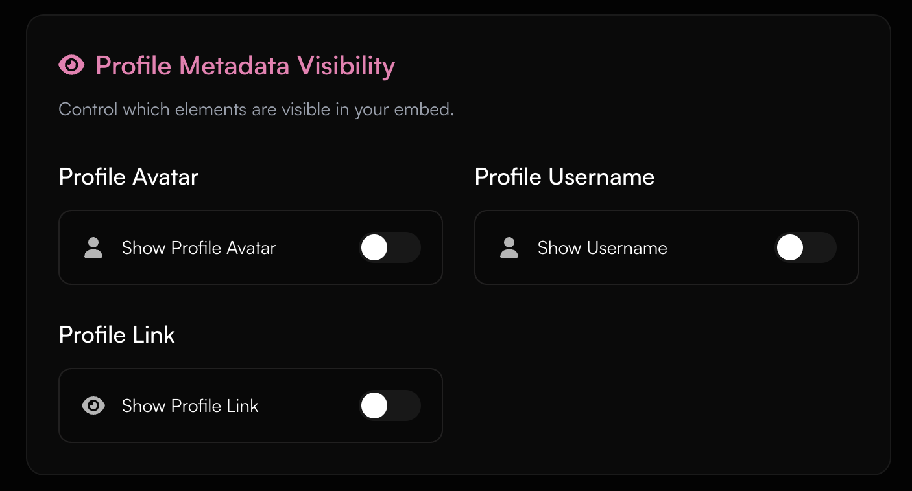

<Card title="Buy Premium" icon="circle-1" href="../guides/premium#how-to-buy-premium-on-haunt-gg" horizontal>
Learn how to buy premium on haunt.gg
</Card>

<Card title="Payment Methods" icon="circle-2" href="../guides/premium#payment-methods" horizontal>
Check out the available payment methods.
</Card>

<Card title="Premium Features" icon="circle-3" href="../guides/premium#premium-features" horizontal>
Check out all premium features.
</Card>

## How to buy Premium on haunt.gg

<Steps>
    <Step title="Go to the pricing page">
        Head over to [haunt.gg/pricing](https://haunt.gg/pricing)
    </Step>
    <Step title="Click on the Buy Button">
        Then click on the button: "Get Lifetime Premium"
    </Step>
    <Step title="Pick your payment method">
        Then pick your preferred payment method
    </Step>
</Steps>

---

## Payment Methods

<Tabs>
    <Tab title="Stripe">
        - You can choose following payment methods via Stripe: Credit/Debit Card, Google Pay, eps-Transfer (Bank Transfer), Klarna, Apple Pay, Giropay
    </Tab>
    <Tab title="Cryptocurrencies">
        - You can choose the following Cryptocurrencies via Cryptomus: USDT, BTC, LTC, ETH, XMR, POL, BNB, USDC, SOL
    </Tab>
    <Tab title="PayPal">
        - You can use PayPal to pay through our trusted Point of Sale software; Paddle
    </Tab>
</Tabs>

---

## Premium Features

<Note>
On desktop, to scroll tabs left/right, **hold Shift** and use the **mouse wheel**.
</Note>

<Tabs>
    <Tab title="Alias">
        - You can create an Alias username that automatically redirects you to your main Bio Page
        <Frame>
            
        </Frame>
    </Tab>
    <Tab title="Profile Metadata">
        - You can set your Discord Embed and your Tab-Title and Favicon with the Profile Metadata
        <Frame>
            
        </Frame>
        <Frame>
            
        </Frame>

        ## Metadata Preview (Discord)
        
        <Frame>
            
        </Frame>
    </Tab>
    <Tab title="Typewriter Descriptions">
        - You can add Multiple Descriptions to display on your Bio with a Typewriter effect
        <Frame>
            
        </Frame>

        ## Typewriter Effect Preview

        <Frame>
            
        </Frame>
    </Tab>
    <Tab title="Cursor Effects">
        - You can add a custom cursor effect that follows your mouse for your Bio
        <Frame>
            
        </Frame>

        ## Cursor Effect Preview

        <Frame>
            
        </Frame>
    </Tab>
    <Tab title="Font Settings">
        - You can change your font for your bio page (the letters of your name and description).
        <Frame>
            
        </Frame>

        ## Font Preview

        <Frame>
            
        </Frame>
    </Tab>
    <Tab title="Profile Animation">
        - You can add a custom animation to your Bio page
        <Frame>
            
        </Frame>

        ## Profile Animation Preview

        <Frame>
            
        </Frame>
    </Tab>
    <Tab title="Username Cooldown">
        - You can change your username without a cooldown
        <Frame>
            
        </Frame>
    </Tab>
    <Tab title="Customizable Border Options">
        - You can update your border's animations
        <Frame>
            
        </Frame>

        ## Animated Border Preview:

        <Frame>
            
        </Frame>
    </Tab>
    <Tab title="Custom Fonts">
        - You can customize the font used on your bio page, including the letters of your name and description.
        <Frame>
            
        </Frame>
    </Tab>

</Tabs>

---

## How do I get the premium rank on the Discord

<Note>
     You can learn more about how to link your rank to Discord in this guide: [Discord Connection](/guides/discord)
</Note>
