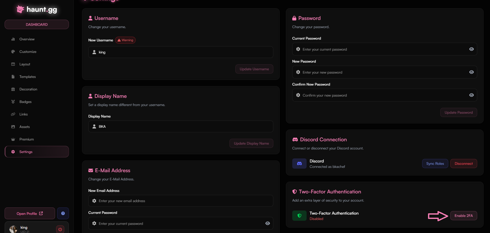
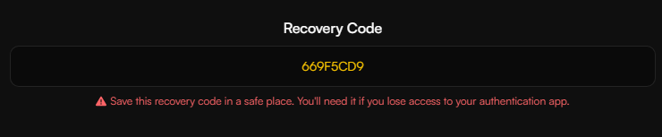
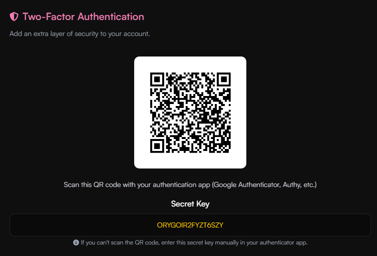
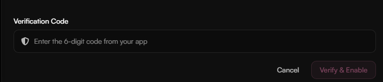
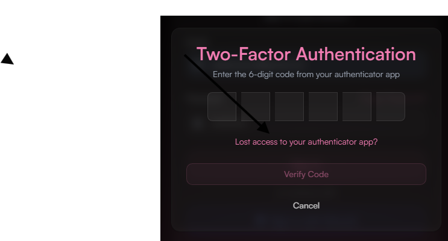

<Warning>
    The Haunt.gg Team do not ask for your credentials in your direct messages. If you receive a message asking for your credentials, it is a phishing attempt. Please report it to our team on [Discord](https://discord.gg/hauntbio).
</Warning>

<Card title="Create and store your password safely" icon="circle-1" href="../guides/security#create-and-store-your-password-safely" horizontal>
Learn how to create and store your password safely.
</Card>

<Card title="Activate Two-Factor-Authetication (2FA)" icon="circle-2" href="../guides/security#activate-two-factor-authentication-2fa" horizontal>
Learn how to activate 2FA for your haunt.gg account.
</Card>

<Card title="What if I lose my 2FA device?" icon="circle-3" href="../guides/security#what-if-i-lose-my-2fa-device" horizontal>
Learn how to recover your account if you lose your 2FA device.
</Card>

<Card title="What if I lose my recovery key?" icon="circle-4" href="../guides/security#what-if-i-lose-my-recovery-key" horizontal>
Learn how to recover your account if you lose your recovery key.
</Card>

## Create and store your password safely

<Steps>
    <Step title="Create a Password">
        Create a Save password with a combination of uppercase, lowercase, numbers and special characters. (Here is a password generator that creates a safe password: [1password](https://1password.com/password-generator))
    </Step>
    <Step title="Store your Password somewhere safe">
        Store your password in a password manager, like for example: [1password](https://1password.com) and not just in your browser, because it's very easy to get your password from your browser.
    </Step>
</Steps>

---

## Activate Two-Factor Authentication (2FA)

<Steps>
    <Step title="Account Settings">
        Head over to your [Account Settings](https://haunt.gg/dashboard/settings)
    </Step>
    <Step title="Click on Enable 2FA">
        Click on the Enable 2FA Button!
        <Frame>
            
        </Frame>
    </Step>
    <Step title="Save your Recovery Code">
        Store your recovery code somewhere safe, because you will need it to recover your account.
        <Frame>
            
        </Frame>        
    </Step>
    <Step Title="Scan the QR code or enter the secret key in your authenticator app">
        Scan the QR code or enter the secret key in your Authenticator app. (For example: Google Authenticator or Authy)
        <Frame>
            
        </Frame>  
    </Step>
    <Step Title="Enter your verification code">
        Enter the verification code that you received in your Authenticator app. Then press on the Click & Verify button
        <Frame>
            
        </Frame>  
    </Step>
</Steps>

---

## What if I lose my 2FA device

<Steps>
    <Step title="Log into youraccount using your recovery code">
        Log into your account and then click on the "Lost access to your authenticator app?" link and enter your recovery code!
    <Frame>
        
    </Frame>              
    </Step>
    <Step title="Disable your 2FA">
        Then go to settings and click on the "Disable 2FA" button to disable your 2FA.
    </Step>
</Steps>

---

## What if I lose my recovery key
 
<Info>
    Please contact our support via our ticket system on [Discord](https://discord.gg/hauntbio) to recover your account.
</Info>