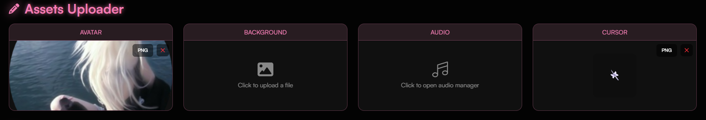

## I can't upload my assets!

<Steps>
    <Step title="Check Our Guide">
        If this is your first time, make sure to check out [our guide on uploading assets](/guides/assets)
    </Step>
    <Step title="Verify File Types">
        Make sure you are using **the correct file types** otherwise, it won't upload!
    </Step>
    <Step title="Check File Size">
        The **max file** size you can upload to is `10MB`; for backgrounds, it's `100MB`.
    </Step>
</Steps>

<Frame>
    
</Frame>