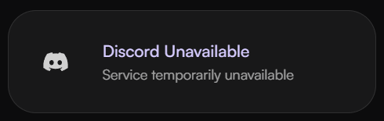

## Discord showing unavailable

<Steps>
    <Step title="Check cccount sync">
        Have you synced your **discord account** to **haunt**? If not, read [this guide](/guides/discord).
    </Step>
    <Step title="Relink your account">
        Try relinking your account the same way you synced it the first time, or if you need help, check out our [guide here](/guides/discord).
    </Step>
</Steps>

<Frame>
    
</Frame>
